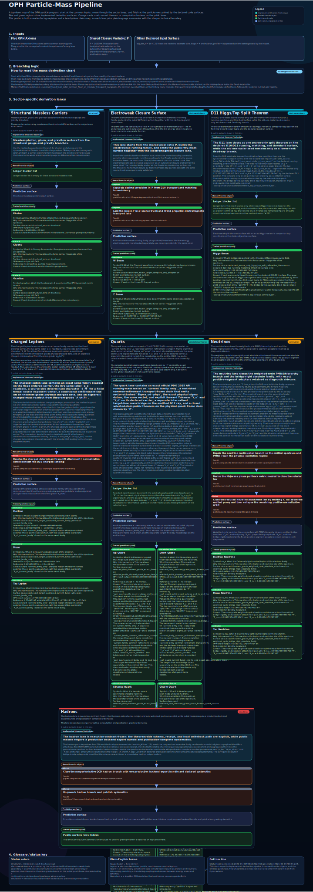

# Observer Patch Holography (OPH)

> Observer Patch Holography starts from a simple restriction: no observer sees the whole world at once. Each observer gets only a local patch, and neighboring patches have to agree where those patches overlap. The question is how much physics can be forced from that fact alone.

**French version:** [README_FR.md](README_FR.md)

**Quick links:** [website](https://floatingpragma.io/oph/) | [OPH Textbooks](https://learn.floatingpragma.io/) | [OPH Lab](https://oph-lab.floatingpragma.io)

OPH is a reconstruction program for fundamental physics. It starts from finite
observers on a finite holographic screen and works outward. Its working basis
is quantum-algebraic: patch algebras, states, trace/Born event probabilities on
declared record surfaces, and generalized entropy are part of the formal
starting point. The program is not a demand to derive every mathematical
ingredient from first principles. Its goal is to construct a consistent and
comprehensive theory of everything by using that algebraic-information basis
to recover the observed effective universe: spacetime, gauge structure,
particles, records, and observer synchronization are treated as consequences
of overlap consistency, not as primitives.

The operational claim is sharper than "information is fundamental." OPH models
reality as an observer-based fixed-point consensus process. Finite observer
patches carry local records, compare only what their overlaps expose, repair
mismatches through declared recovery moves, and settle into stable fixed points
that survive refinement. The public world is the overlap-stable output of that
process. In this sense, OPH treats reality as a computational process, not as a
static stage on which computation merely happens.

## Where To Start

If you want the compact technical core, start with **Paper 2. [Recovering
Relativity and the Standard Model from Observer Overlap
Consistency](paper/recovering_relativity_and_standard_model_structure_from_observer_overlap_consistency_compact.pdf)**.
It carries the relativity, gravity, and Standard Model structure in the
tightest form. **Paper 3. [Deriving the Particle Zoo from Observer
Consistency](paper/deriving_the_particle_zoo_from_observer_consistency.pdf)**
carries the particle derivations. **Paper 4. [Reality as a Consensus
Protocol](paper/reality_as_consensus_protocol.pdf)** develops the consensus and
repair picture. **Paper 5. [Screen Microphysics and Observer
Synchronization](paper/screen_microphysics_and_observer_synchronization.pdf)**
covers finite screen architecture, records, and observer machinery. This
README, Paper 1, and the book are the broad overviews.

## What OPH Delivers

Most theories begin by assuming spacetime, quantum fields, and a list of
constants. OPH starts one step earlier than spacetime and quantum field theory,
with finite observers on a finite quantum-algebraic holographic screen whose
descriptions have to agree where their patches overlap. Push that requirement
hard enough and a `3+1D` Lorentzian spacetime emerges, together with a
Jacobson-style Einstein equation and the realized Standard Model quotient
`SU(3) x SU(2) x U(1) / Z_6`, including the exact hypercharge lattice, the
realized color triplet `N_c = 3`, and the generation count `N_g = 3`. Quantum
mechanics is treated as the algebraic information language carried by the OPH
architecture. The reconstruction test is whether that basis coherently
recovers the effective universe, not whether every mathematical ingredient has
been derived from an empty starting point.

The mechanism is the fixed-point consensus loop. Local observers do not access
a global state from outside. They carry finite patch states, exchange
overlap-visible data, reject inconsistent continuations, and keep the stable
patterns that can be synchronized. Geometry, particles, laws, and records are
the large-scale fixed points of that observer-network computation.

The scale is set by two quantities: the total screen capacity
`N_scr = log dim H_tot`, read from the de Sitter horizon, and the local pixel
ratio `P = a_cell / l_P^2`, which fixes the size of one screen cell in Planck
areas. For the observed cosmological constant, the bare horizon area ratio is
`N_patch = (R_dS / l_P)^2 ≈ 1.05e122`, while the entropy capacity used by OPH is
`N_scr = pi N_patch ≈ 3.31e122`. From the outside, `P` is a geometric cell size that sits
slightly above the self-similar balance `φ = (1 + sqrt(5)) / 2`. From the
inside, it becomes the smallest electromagnetic observation scale available to
observers in the world encoded on that screen. OPH finds the fine-structure
constant by asking for the nonzero detuning of a holographic screen cell such
that the cell's outer geometric displacement from perfect self-similar
equilibrium equals the electromagnetic observation scale emitted by the
universe living on that same screen. The closure is
`P = φ + α_in(P) sqrt(pi)`. For the 2022 CODATA/NIST central value
`α⁻¹(0) = 137.035999177`, that outer formula gives
`P = 1.630968209403959...`. The same fixed-point geometry is also probed in a
separate optical-cavity hardware note.

From the same setup come gravity, gauge structure, the electroweak sector,
the Higgs-top pair, quark masses and Yukawas, neutrino structure, records, and
observer synchronization. Hadrons are not simple quark entries: their masses
belong to the nonperturbative QCD bound-state problem.

### Selected Quantitative Rows

This table keeps the rows that are easiest to compare directly with PDG and
NIST values. Structural results such as the `3+1D` Lorentzian spacetime, the
Standard Model quotient `SU(3) x SU(2) x U(1) / Z_6`, the exact hypercharge
lattice, the realized color triplet `N_c = 3`, and the generation count
`N_g = 3` live in the papers. The
quick view here sticks to direct numeric rows and exact zeros.

| Quantity | Symbol | OPH | PDG/NIST | Δ |
| --- | --- | --- | --- | --- |
| Gravitational constant | G | 6.6742999959e-11 | 6.67430(15)e-11 | 0.00003σ |
| Speed of light | c | 299792458 | 299792458 (exact) | match |
| Fine-structure (inv) | α⁻¹(0) | `P` closure gives 137.035999177 | 137.035999177(21) | match |
| Photon mass | m_γ | 0 eV | <1e-18 eV | below bound |
| Gluon mass | m_g | 0 GeV | 0 GeV | match |
| Graviton mass | m_grav | 0 eV | <1.76e-23 eV | below bound |

**Quark sector**

| Quark | Symbol | OPH | PDG | Δ |
| --- | --- | --- | --- | --- |
| Bottom | m_b(m_b) | 4.183 GeV | 4.183 ± 0.007 | match |
| Charm | m_c(m_c) | 1.273 GeV | 1.2730 ± 0.0046 | match |
| Strange | m_s(2 GeV) | 93.5 MeV | 93.5 ± 0.8 | match |
| Down | m_d(2 GeV) | 4.70 MeV | 4.70 ± 0.07 | match |
| Up | m_u(2 GeV) | 2.16 MeV | 2.16 ± 0.07 | match |

`Δ` reports the sigma distance where PDG or NIST quotes a one-standard-deviation
uncertainty. Otherwise it records `match` or `below bound`.

For quarks, PDG uses its standard mass conventions: `u`, `d`, and `s` at
`2 GeV`, with `c` and `b` in the `MS` scheme at their own mass scale. The
papers also carry the structural Standard Model derivations listed above and a
neutrino family, but those do not collapse to one simple PDG or NIST row and
are left out of this table.

The public electroweak surface also includes a Higgs value
`m_H = 125.1995304097179 GeV` and a companion top value
`m_t = 172.3523553288312 GeV` in the same calculation.

## Local Unification Surface

The local unification surface is organized around the pixel ratio `P` and one
local ruler, `a_cell`. On that surface the same scale touches the electroweak
bosons, the Higgs lane, the gravity-side entropy relation, and the familiar
unit readout for meters, seconds, GeV, and Kelvin. The diagram below shows how
those pieces sit on one scale. The detailed formulas live in the papers.

  

Detailed particle outputs live in [code/particles/RESULTS_STATUS.md](code/particles/RESULTS_STATUS.md) and [code/particles/EXACT_NONHADRON_MASSES.md](code/particles/EXACT_NONHADRON_MASSES.md).

**OPH Stack**

  

The main OPH line from axioms to relativity, gauge structure, particles, and observers. Click to open the full SVG.

**Particle derivation stack**

  

A compact view of the particle lane. Click to open the full SVG.

## Papers

- **Paper 1. [Observers Are All You Need](paper/observers_are_all_you_need.pdf)**: broad synthesis across the full OPH stack.
- **Paper 2. [Recovering Relativity and the Standard Model from Observer Overlap Consistency](paper/recovering_relativity_and_standard_model_structure_from_observer_overlap_consistency_compact.pdf)**: compact technical core for relativity, gravity, and Standard Model structure.
- **Paper 3. [Deriving the Particle Zoo from Observer Consistency](paper/deriving_the_particle_zoo_from_observer_consistency.pdf)**: particle derivations and the quantitative mass and coupling surface.
- **Paper 4. [Reality as a Consensus Protocol](paper/reality_as_consensus_protocol.pdf)**: repair, fixed-point, and consensus picture.
- **Paper 5. [Screen Microphysics and Observer Synchronization](paper/screen_microphysics_and_observer_synchronization.pdf)**: finite screen architecture, records, and observer synchronization.

## More

- **Website:** [floatingpragma.io/oph](https://floatingpragma.io/oph)
- **Theory explainer:** [floatingpragma.io/oph/theory-of-everything](https://floatingpragma.io/oph/theory-of-everything)
- **Simulation-theory explainer:** [floatingpragma.io/oph/simulation-theory](https://floatingpragma.io/oph/simulation-theory/)
- **Book:** [oph-book.floatingpragma.io](https://oph-book.floatingpragma.io)
- **Guided study app:** [learn.floatingpragma.io](https://learn.floatingpragma.io/)
- **Questions and detailed explanations:** OPH Sage on [Telegram](https://t.me/HoloObserverBot), [X](https://x.com/OphSage), or [Bluesky](https://bsky.app/profile/ophsage.bsky.social)
- **Lab:** [oph-lab.floatingpragma.io](https://oph-lab.floatingpragma.io)
- **Common objections:** [extra/COMMON_OBJECTIONS.md](extra/COMMON_OBJECTIONS.md)
- **IBM Quantum note:** [extra/IBM_QUANTUM_CLOUD.md](extra/IBM_QUANTUM_CLOUD.md)

## Repository Guide

- **[`paper/`](paper):** PDFs, LaTeX sources, and release metadata.
- **[`book/`](book):** OPH Book source. Print-PDF build notes live in [`book/README.md`](book/README.md).
- **[`code/`](code):** computational material, particle outputs, and experiments.
- **[`assets/`](assets):** public diagrams and figures.
- **[`extra/`](extra):** maintained public notes such as objections, experimental write-ups, and selected supporting essays.

## OPH and the Sciences

  

A domain -> subdomain -> OPH-area map spanning mathematics, computer science, information and inference, complex systems, theoretical physics, quantum information, and measurement foundations. Click to open the full poster PNG.

