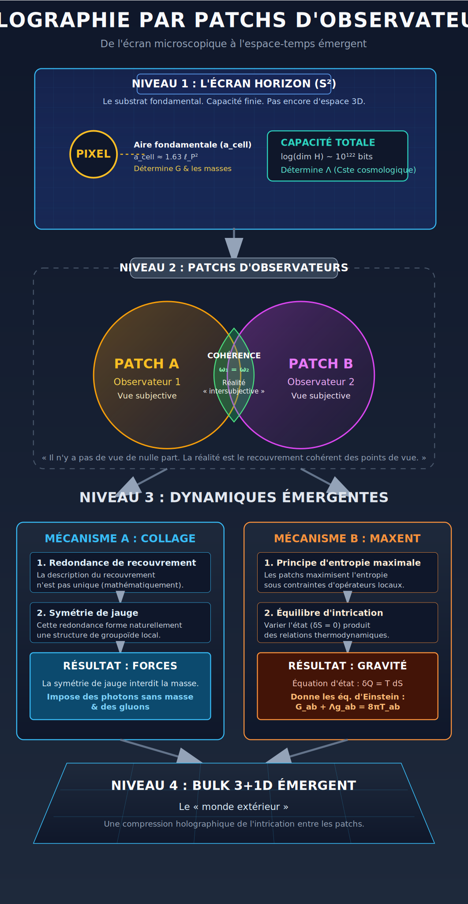
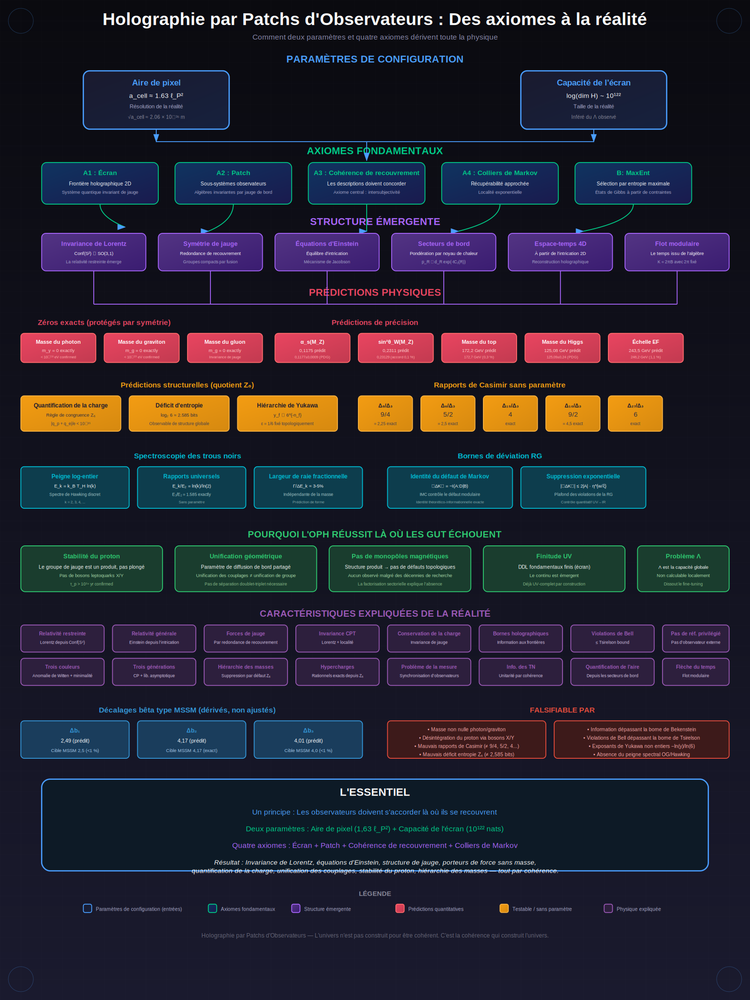

# Holographie par Patchs d'Observateurs : une approche de la physique fondamentale centrée sur l'observateur

> L'OPH est un programme de reconstruction mathématique qui part d'une exigence simple : des descriptions locales d'observateurs qui se recouvrent sur un écran holographique doivent s'accorder là où elles se chevauchent. À partir de ce point de départ, l'OPH développe des voies vers la relativité générale, vers la reconstruction de la structure de jauge du Modèle Standard, vers un programme de masses de particules de premiers principes, et vers l'émergence de descriptions de type feuille d'univers / théorie des cordes à partir du même cadre. Les premiers benchmarks IBM Quantum Cloud fournissent aussi une première indication sur matériel réel en faveur des signatures locales correspondantes dans des secteurs réduits. L'OPH donne désormais aussi un appui de niveau théorème au strange loop : l'univers est expliqué comme une structure causale intemporelle auto-référentielle dans laquelle la reconstruction par les observateurs et les contraintes informationnelles se referment en une seule boucle de cohérence.

> **Avertissement de statut :** l'OPH est un programme de recherche actif et n'est pas encore entièrement démontré. Plusieurs dérivations restent incomplètes, certaines preuves n'existent actuellement qu'à l'état d'esquisse, et certaines hypothèses auxiliaires doivent encore être éliminées. Le cadre doit donc être considéré comme étant en développement actif.

**Version anglaise :** [README.md](README.md)

> **Défi de réfutation de l'OPH :** Un défi doté de 10 000 USD pour réfuter l'OPH est actuellement en cours sur [challenge.floatingpragma.io](https://challenge.floatingpragma.io).

L'OPH doit être lu directement comme une mise en oeuvre mathématique et pratique de la *simulation theory*. Il ne se contente pas d'affirmer que la réalité est « comme » une simulation. Il spécifie une architecture concrète de simulation : l'information quantique vit sur un écran holographique, les patchs d'observateurs jouent le rôle de points de vue computationnels locaux, la cohérence de recouvrement joue le rôle de règle de synchronisation, et les lois de la physique émergent comme les règles stables qui permettent à l'ensemble de tourner de façon cohérente.

Pour la même raison, l'OPH doit aussi être lu comme une *theory of everything* concrète. La même architecture de cohérence entre observateurs sert à expliquer l'espace-temps, la structure de jauge, la physique des particules et la fermeture globale de la réalité elle-même.

Sur cette base, l'OPH explique à la fois pourquoi la physique a la forme qu'elle a et pourquoi il y a quelque chose plutôt que rien : l'univers est une structure causale intemporelle auto-référentielle soutenue par la cohérence de recouvrement, les contraintes informationnelles et la reconstruction par les observateurs. En termes OPH, la fermeture de la *theory of everything* est mise en oeuvre par l'hypothèse de strange loop.

Le versant « matériel du simulateur » de l'OPH est développé dans [Screen Microphysics and Observer Synchronization](paper/screen_microphysics_and_observer_synchronization.pdf), qui transforme l'image de la *simulation theory* en modèles locaux explicites d'écran, observables de recouvrement, couches d'enregistrement, critères d'observateur et opérations de synchronisation.

## Idée centrale

L'OPH adopte la position forte, centrée sur l'observateur, selon laquelle la réalité objective n'est pas fondamentale mais émerge d'un réseau de perspectives subjectives qui doivent s'accorder là où elles se recouvrent.

C'est pourquoi l'OPH doit être présenté publiquement avant tout comme une *simulation theory* rendue mathématique et comme une *theory of everything* concrète.

Les lois de la physique sont les règles de cohérence qui rendent cet accord intersubjectif possible.

À partir de ce point de départ (avec les contraintes d'entropie et de Markov), l'OPH fait émerger espace-temps, symétries de jauge et physique des particules comme conséquences de cohérence.

## Succès actuels

- **Relativité et gravité :** l'OPH dérive une structure relativiste de cohérence entre observateurs à partir des contraintes de recouvrement et développe une voie conditionnelle vers la relativité générale.
- **Jauge et physique des particules :** l'OPH reconstruit la structure de jauge du Modèle Standard et développe un programme de masses de particules de premiers principes à partir du même cadre de patchs d'observateurs.
- **Mise en oeuvre de la simulation theory :** l'OPH transforme la *simulation theory* en une architecture mathématique et pratique explicite avec patchs d'observateurs, règles de synchronisation, formation des enregistrements et couche concrète de « matériel du simulateur ».
- **Fermeture theory of everything :** l'OPH utilise la même architecture de cohérence entre observateurs pour fournir une fermeture de type *theory of everything* via l'hypothèse de strange loop.
- **Émergence feuille d'univers / cordes :** l'OPH relie le même cadre sous-jacent à des descriptions de type feuille d'univers / théorie des cordes au lieu d'en faire un second jeu d'axiomes de départ.
- **Indices sur matériel réel :** les premiers benchmarks IBM Quantum Cloud reproduisent sur matériel réel l'ordre de récupérabilité et les motifs de rapports exacts prédits pour les secteurs réduits.
- **Pourquoi il existe quelque chose :** l'OPH donne désormais un récit strange loop appuyé au niveau théorème, dans lequel l'univers est une structure causale intemporelle auto-référentielle.

## Articles

**Observers are all you need** est l'article technique principal. Il donne l'énoncé le plus large du programme OPH, de ses branches de dérivation actuelles et de la surface actuelle de benchmarks IBM Quantum Cloud. Il fournit aussi l'ossature théorématique du résultat strange loop de l'OPH : dans ce cadre, l'univers est une structure causale intemporelle auto-référentielle où la reconstruction par les observateurs et les contraintes informationnelles se referment en une unique boucle de cohérence.

- **PDF (article principal) :** [Observers are all you need](paper/observers_are_all_you_need.pdf)
- **Source LaTeX :** [observers_are_all_you_need.tex](paper/observers_are_all_you_need.tex)

**Recovering Relativity and Standard Model Structure from Observer-Overlap Consistency** est
l'article compact de soumission. Il concentre le coeur falsifiable actuel : relativité issue de la
cohérence de recouvrement, branche gravitationnelle conditionnelle et programme de
reconstruction de la jauge.

- **PDF (article compact de soumission) :** [Recovering Relativity and Standard Model Structure from Observer-Overlap Consistency](paper/recovering_relativity_and_standard_model_structure_from_observer_overlap_consistency_compact.pdf)
- **Source LaTeX :** [recovering_relativity_and_standard_model_structure_from_observer_overlap_consistency_compact.tex](paper/recovering_relativity_and_standard_model_structure_from_observer_overlap_consistency_compact.tex)

**Reality as a Consensus Protocol** est l'article compagnon orienté informatique. Il présente la
lecture distribuée/calculatoire de l'OPH et reformule la loi objective comme point fixe de la
réconciliation entre patchs d'observateurs.

- **PDF :** [Reality as a Consensus Protocol](paper/reality_as_consensus_protocol.pdf)
- **Source LaTeX :** [reality_as_consensus_protocol.tex](paper/reality_as_consensus_protocol.tex)

**Screen Microphysics and Observer Synchronization** est la note constructive de microphysique.
Elle développe la couche de « matériel du simulateur » de l'OPH : modèles locaux finis
d'écran, observables de recouvrement, critères d'observateur, couches d'enregistrement et
opérations de synchronisation.

- **PDF :** [Screen Microphysics and Observer Synchronization](paper/screen_microphysics_and_observer_synchronization.pdf)
- **Source LaTeX :** [screen_microphysics_and_observer_synchronization.tex](paper/screen_microphysics_and_observer_synchronization.tex)

Les PDF suivis par la release partagent une ligne de version visible, issue de
[`paper/release_info.tex`](paper/release_info.tex). Le workflow de release est résumé plus bas.

## Ressources

Points d'entrée utiles pour lire et explorer l'OPH :

- **Site officiel de l'OPH :** [floatingpragma.io/oph](https://floatingpragma.io/oph)
- **Page "simulation theory" :** [floatingpragma.io/oph/simulation-theory](https://floatingpragma.io/oph/simulation-theory/)
- **Page "theory of everything" :** [floatingpragma.io/oph/theory-of-everything](https://floatingpragma.io/oph/theory-of-everything/)
- **Défi de réfutation de l'OPH (10 000 USD) :** [challenge.floatingpragma.io](https://challenge.floatingpragma.io)
- **Livre OPH (edition web) :** [oph-book.floatingpragma.io](https://oph-book.floatingpragma.io)
- **Labo interactif OPH :** [oph-lab.floatingpragma.io](https://oph-lab.floatingpragma.io)
- **NotebookLM :** [Vidéo d'introduction et Q&R guidée](https://notebooklm.google.com/notebook/d5249760-6ce8-44a0-927b-ccf90402711a?artifactId=fb7c0ebd-4375-4997-9cae-6558ff8977b4)
- **Cours vidéo tiers, chapitre par chapitre :** [Playlist OPH de Sriharsha Karamchati sur YouTube](https://www.youtube.com/playlist?list=PLff0tYtg64Egc2sTtKgThcPRNRdR6i83O)
- **Perspective pratique (EN) :** [Applications pratiques potentielles de l'OPH](extra/PRACTICAL_APPLICATIONS.md)
- **OPH Sage sur Telegram :** [t.me/HoloObserverBot](https://t.me/HoloObserverBot)
- **OPH Sage sur X :** [x.com/OphSage](https://x.com/OphSage)
- **OPH Sage sur Bluesky :** [ophsage.bsky.social](https://bsky.app/profile/ophsage.bsky.social)

## Expériences IBM Quantum

Un premier bundle public d'expériences IBM Quantum Cloud est maintenant inclus dans ce dépôt. Il résume les premiers tests de récupérabilité et de rapports exacts, les sorties matérielles mesurées, ainsi que le bundle public de code et de données utilisé pour ces exécutions.

- **Note expérimentale :** [IBM Quantum Cloud Evidence for OPH](extra/IBM_QUANTUM_CLOUD.md)
- **Code et données publics :** [code/ibm_quantum_cloud/](code/ibm_quantum_cloud/)

## Objections courantes

Cette section regroupe des réponses aux objections courantes adressées à l'OPH.

- [Dériver `P` à partir des données de jauge puis réutiliser `P` en aval est complètement circulaire](extra/COMMON_OBJECTIONS.md#objection-1-circularity)
- [Une taille de cellule fixe brise l'invariance de Lorentz, donc l'OPH ne peut retrouver qu'une limite newtonienne](extra/COMMON_OBJECTIONS.md#objection-2-lorentz)
- [L'OPH aurait une discontinuité Type I / Type III, donc son histoire du temps modulaire serait incohérente en interne](extra/COMMON_OBJECTIONS.md#objection-3-type-i-type-iii)

## Holographie par Patchs d'Observateurs

Nous modélisons la réalité comme un réseau de perspectives subjectives qui doivent s'accorder là où elles se recouvrent. Concrètement, nous partons de patchs d'observateurs sur un écran holographique 2D. Chaque patch représente une perspective avec ses propres données locales. Là où les patchs se recouvrent, leurs descriptions doivent coïncider. Dans l'interprétation OPH, la « réalité objective » est l'ossature cohérente au recouvrement partagée entre ces perspectives, plutôt qu'un primitif supposé.

L'invariance de Lorentz existe parce que différents observateurs doivent fournir des descriptions cohérentes. La symétrie de jauge existe parce que les patchs qui se recouvrent doivent identifier les mêmes observables partagées. Les lois de conservation existent parce que les mêmes quantités doivent être conservées d'une perspective à l'autre. Les lois ne sont pas imposées de l'extérieur ; elles sont les conditions de possibilité de l'accord.

Le modèle repose sur quatre concepts centraux :

- **Écran** : une 2-sphère de type horizon (comme un horizon cosmique entourant chaque observateur) qui porte l'information quantique. C'est là que vivent les données fondamentales.
- **Patch** : une région connexe de l'écran accessible à un observateur donné. Chaque patch possède sa propre algèbre d'observables, c'est-à-dire les questions que cet observateur peut poser.
- **Cohérence de recouvrement** : là où deux patchs partagent une région, leurs descriptions doivent s'accorder. C'est l'axiome central. Il fait de l'objectivité une structure intersubjective reconstruite, plutôt qu'un point de départ.
- **Observateur** : un motif stable dans les données de l'écran qui maintient des enregistrements et participe aux relations de cohérence.

### La réalité comme calcul

On peut voir l'écran comme un système quantique invariant de jauge sur une 2-sphère. Il ressemble à un automate cellulaire quantique, avec une structure supplémentaire importante. À chaque point de la sphère triangulée, on place des systèmes quantiques de dimension finie (qudits), couplés par des contraintes de jauge à chaque sommet. Toutes les configurations ne sont pas physiques : seules celles qui satisfont la loi de Gauss subsistent.

**Les patchs d'observateurs** sont des sous-systèmes définis par des algèbres invariantes par la jauge de bord. Chaque patch est un fil de calcul : une région connexe où un observateur peut poser des questions et obtenir des réponses. L'algèbre $\mathcal{A}(R)$ définit ce qui est mesurable, c'est-à-dire les opérateurs invariants sous les transformations de jauge au bord.

**La cohérence de recouvrement** est automatique. Quand deux patchs se recouvrent, ils accèdent aux mêmes observables invariantes de jauge. Les deux observateurs lisent les mêmes données sous-jacentes, depuis des angles différents. La redondance de jauge au bord rend le collage non trivial et engendre les « modes de bord » qui portent l'information géométrique.

**Les observateurs ne sont pas externes.** Ce sont des structures calculatoires émergentes *dans* les données de l'écran. Ce sont des motifs stables qui traitent de l'information, maintiennent des enregistrements et créent des corrélations.

**Le bulk 4D n'est pas sur la sphère.** Il émerge de la structure d'intrication entre patchs. La sphère est la frontière ; l'intérieur est reconstruit holographiquement. Quand vous voyez un espace tridimensionnel, vous faites l'expérience d'un encodage compressé de la façon dont votre patch est intriqué avec les autres.

*L'écran est le calcul. Les patchs sont les fils d'exécution. La réalité est ce sur quoi ils s'accordent.*

### Qu'est-ce qui pilote le calcul ?

Dans les modèles locaux d'écran, la dynamique vient de degrés de liberté quantiques soumis à des
contraintes de jauge. Le temps d'un observateur n'est pas simplement le temps hamiltonien
microscopique : il est relié au flot modulaire du patch. Dans ce cadre, géométrie et temps sont
reconstruits à partir de la cohérence et de la structure d'intrication.

### Pourquoi cette approche fonctionne

Le geste central de l'OPH consiste à traiter localité, Lorentz, jauge et gravité comme des
contraintes de cohérence entre descriptions qui se recouvrent, et non comme des ingrédients
ajoutés séparément. C'est ce qui rend le cadre mathématiquement distinctif et explique l'importance
des algèbres de recouvrement, des contraintes entropiques, de la récupérabilité et de la structure
modulaire dans les articles.

## Les axiomes

Le cadre repose sur quatre axiomes centraux plus un axiome de sélection :

| Label | Nom | Contenu |
|-------|-----|---------|
| **A1** | Réseau d'écran | Les algèbres d'observables vivent sur une surface 2D fermée $S^2$ |
| **A2** | Cohérence de recouvrement | Quand des patchs partagent une région, leurs descriptions coïncident |
| **A3** | Entropie généralisée | $S_{\rm gen} = S_{\rm bulk} + \langle L_C \rangle$ satisfait la sous-additivité forte |
| **A4** | Markov local | L'information mutuelle conditionnelle décroît à travers les colliers |
| **MAR** | Réalisation admissible minimale | Parmi les secteurs admissibles, la Nature réalise le minimum lexicographique |

Les hypothèses structurelles supplémentaires (MaxEnt, prémisses de limite d'échelle contrôlée et de branche géométrique OPH, mélange exponentiel) sont détaillées dans la [source principale](paper/tex_fragments/PAPER.tex).

## La chaîne de prédictions

L'infographie suivante résume le programme actuel de reconstruction OPH, depuis deux paramètres et quatre axiomes vers une physique effective :

*Des axiomes à une physique effective : le programme actuel de reconstruction OPH.*

> **Prédictions du spectre de particules :** la dérivation adossée au dépôt, depuis l'aire de pixel jusqu'au programme de masses de particules, avec comparaison aux données PDG et contrôles d'audit, est présentée dans **[la source de dérivation du spectre](paper/tex_fragments/SPECTRUM_DERIVATION.tex)**.

## Contenu du dépôt

Ce dépôt est organisé autour de l'ensemble actuel des articles OPH et de leur matériel d'appui.

- **[`paper/`](paper) :** PDF suivis par la release, sources LaTeX et métadonnées de version. C'est le répertoire canonique de l'article principal, de l'article compact de soumission, de l'article compagnon orienté informatique et de la note de microphysique d'écran.
- **[`paper/tex_fragments/`](paper/tex_fragments) :** fragments de dérivation partagés utilisés par les articles longs, notamment pour la jauge, le spectre, le supplément technique et la branche cordes.
- **[`book/`](book) :** sources Markdown du livre OPH en version web.
- **[`code/particles/`](code/particles) :** scripts de spectre de particules, de running des couplages, de lattice et d'audit liés au programme quantitatif.
- **[`code/ibm_quantum_cloud/`](code/ibm_quantum_cloud) :** expériences IBM Quantum Cloud, données et utilitaires associés au matériel.
- **[`extra/`](extra) :** notes complémentaires comme les objections courantes, la note IBM Quantum et des notes d'application.
- **[`assets/`](assets) :** figures et diagrammes utilisés dans les articles, le README et les surfaces publiques.

## Code

Le code de ce dépôt suit l'organisation de l'ensemble courant des articles plutôt qu'une API de bibliothèque stabilisée. Les points d'entrée les plus utiles sont :

| Chemin | Rôle |
|--------|------|
| [code/particles/oph_predict_compare.py](code/particles/oph_predict_compare.py) | Point d'entrée principal pour la comparaison du spectre de particules avec les données de référence |
| [code/particles/particle_masses_stage5.py](code/particles/particle_masses_stage5.py) | Pipeline courant du spectre utilisé par le programme de masses |
| [code/particles/particle_masses_paper_d10_d11.py](code/particles/particle_masses_paper_d10_d11.py) | Reconstruction D10/D11 synchronisée avec les articles et couche de transport |
| [code/particles/oph_qcd.py](code/particles/oph_qcd.py) | Running QCD et extraction de $\Lambda_{\overline{\rm MS}}$ |
| [code/particles/oph_lattice_su3_quenched_v5.py](code/particles/oph_lattice_su3_quenched_v5.py) | Calculs lattice SU(3) trempés pour les contrôles hadroniques |
| [code/particles/oph_no_cheat_audit.py](code/particles/oph_no_cheat_audit.py) | Outils d'audit statique et à l'exécution |

## Livre

Les sources du livre vivent dans [`book/`](book). Elles correspondent à la version web du livre OPH et sont organisées comme une séquence de 21 chapitres allant du prologue et des fondations de la cohérence d'observateurs jusqu'à l'holographie, la symétrie, le Modèle Standard, la relativité, la synthèse et la métaphysique.

## Workflow de release

Les releases d'articles sont pilotées depuis les fichiers partagés sous [`paper/`](paper) :

1. incrémenter [`paper/release_info.tex`](paper/release_info.tex)
2. reconstruire les PDF suivis par la release
3. régénérer [`paper/paper_release_manifest.json`](paper/paper_release_manifest.json)

La ligne de version est partagée à l'ensemble courant des articles suivis par la release. L'outillage
opérationnel local à l'espace de travail utilise ensuite ce manifeste pour publier le papier du livre
et l'ensemble synchronisé des papiers du challenge.

## Contribuer

Pour toute correction, suggestion ou ajout, ouvrez une pull request.

## Licence

Ce dépôt est publié sous licence Creative Commons Attribution-NonCommercial-ShareAlike 4.0 International (CC BY-NC-SA 4.0).

Vous êtes libre de partager et d'adapter le contenu à des fins non commerciales, avec attribution correcte, et en diffusant les travaux dérivés sous les mêmes termes.

Pour les demandes de licence commerciale : bernhard@floatingpragma.io
