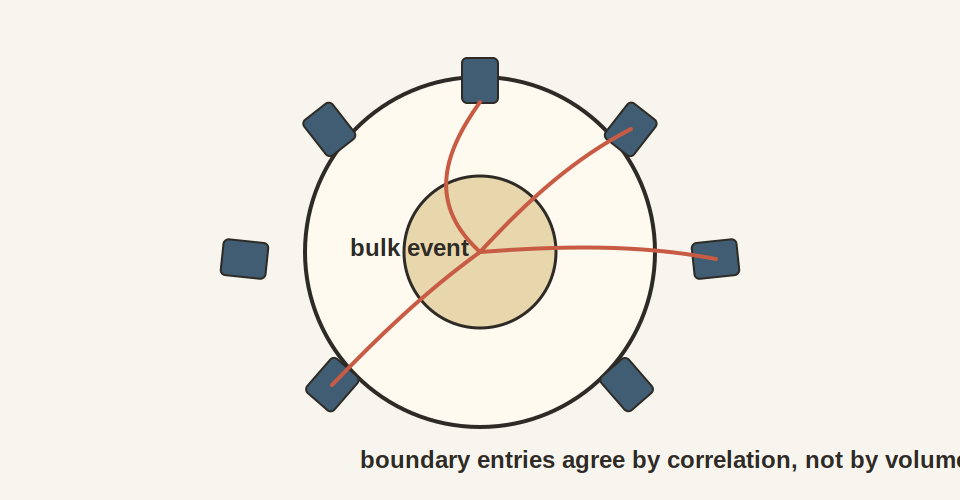

# Chapter 8: Why Holography Looks Like a Boundary

## 8.1 The Intuitive Picture: Reality Lives in Volume

Start with the ordinary intuition about storage.

Information fills space. The more volume you have, the more stuff you can pack
into it. Double the size of a box, and you can store twice as much
information. Triple it, triple the storage. This is so obvious it hardly seems
worth stating.

If you want to describe a region of the universe completely, you need to specify what's happening at every point in the volume. A cubic meter has more information capacity than a square meter, which has more than a linear meter. The three-dimensional interior is where the action is; surfaces are just boundaries, interfaces, the thin walls separating volumes from each other.

This intuition is embedded in how we think about containers, databases, and physical space itself. The library holds books in its volume, not on its walls. The hard drive stores data throughout its platters, not on the outer casing. The universe is a three-dimensional stage, and everything happens on that stage.

Black holes broke that picture.

## 8.2 The Surprising Hint: Information Lives on Boundaries

### The Black Hole Entropy Puzzle

The first hint came from black holes.

{width=80%}

In the 1970s, Bekenstein and Hawking showed that black hole entropy is proportional to surface area, not volume. A black hole with twice the horizon area has twice the entropy-twice the information content. This was strange. Normal systems have entropy proportional to volume. A box twice as big can hold twice as much stuff.

But black holes are different. Their information lives on the surface:

$$S_{BH} = \frac{k_B c^3}{4 G \hbar} A = \frac{A}{4 \ell_P^2}$$

In entropy units, black hole entropy is $A/(4\ell_P^2)$; in bits this becomes $A/(4\ell_P^2 \ln 2)$.

$S_{BH}$ is Bekenstein-Hawking entropy. $A$ is horizon area. The constants
$k_B$, $c$, $G$, and $\hbar$ convert the area law into ordinary physical
units. The Planck length $\ell_P$ packages those constants into one length
scale, so the second expression reads as area counted in Planck units.

### The Bekenstein Bound

Bekenstein realized this wasn't just about black holes. It was a universal limit.

Lower a box of entropy toward a black hole on a rope. As it approaches the horizon, energy is redshifted. When the box finally crosses the horizon, the universe seems to lose the entropy that was in the box.

This would violate the second law of thermodynamics-unless the black hole gains enough entropy to compensate. But how much entropy can the box hold?

If you try to pack too much entropy into a small region, the energy required creates a black hole. The black-hole saturation scaling is:

$$S_{BH} \sim \frac{R^2}{\ell_P^2}$$

-proportional to the area, not the volume.

The original **Bekenstein bound** is

$$S \leq \frac{2\pi R E}{\hbar c}$$

and black-hole saturation is what turns that pressure into the familiar area law. Together they show that gravity pushes information storage toward boundary scaling.

Here $S$ is entropy, $R$ is the radius of the system, and $E$ is its total
energy. The bound says that a finite region with finite energy cannot carry
unlimited information.

### The Holographic Principle

In 1993, Dutch physicist Gerard 't Hooft made a wild suggestion. He proposed that this isn't just true for black holes. It is true for everything.

**The Holographic Principle**: The maximum information in any region of space is proportional to its surface area. Volume is the wrong counting variable.

If the holographic principle is true, then the 3D world we experience is somehow encoded on 2D surfaces. The third dimension is an illusion-a convenient description of correlations on a boundary.

Leonard Susskind developed these ideas further, connecting them to string theory. The holographic principle still remained vague: a principle, without a calculation.

Information capacity scales with area. The bulk seems three-dimensional, while its information fits on a two-dimensional surface.

## 8.3 The First-Principles Reframing: Boundaries Are Consistency Ledgers

The deeper question is why nature keeps pushing bulk physics to the boundary.

### Dennis Gabor's Hologram

Before the physics, there was a microscope problem.

In 1947, Dennis Gabor was trying to improve electron microscopes. He devised a trick to record the full wave information, including phase as well as brightness.

Split a light beam into two parts. One beam hits the target and scatters. The other goes straight to the film. When they meet on the film, they interfere, creating patterns of bright and dark fringes. The interference pattern encodes phase.

When you shine light back through that pattern, something magical happens: a three-dimensional image appears, floating in space.

Gabor called this a "hologram" from the Greek *holos* (whole) and *gramma* (message). He won the Nobel Prize in 1971.

### The Strange Property of Holograms

There's a stranger fact about holograms. Cut one into pieces and each piece still shows the whole object, just with less detail. The entire image is encoded everywhere on the film, redundantly.

The analogy fits the observer picture. Each patch contains a partial image:
blurred, incomplete, yet still tied to the same world. The overlap between
patches plays the role of the interference pattern. That is how the shared
account stays consistent.

### The Consistency Ledger

**Boundaries are shared records where observers compare notes.**

Reality emerges from the agreement of observer patches. But where do observers
compare notes? They need a shared record, a common reference where their
descriptions must match.

The boundary serves exactly this role. It's where the bookkeeping lives. Each
observer's patch includes a region of the boundary. When patches overlap, the
boundary values must agree. The bulk emerges as the most consistent account
that fits all the boundary data.

This explains why information scales with area, not volume. The boundary is the fundamental storage; the bulk is derivative. There's no hidden interior capacity beyond what the surface encodes-because the interior *is* the surface, reorganized into a convenient three-dimensional description.

## 8.4 The Soup Can Universe

Imagine you live inside a soup can. Not a normal soup can-this one is infinitely tall and wide, yet a beam of light can reach the wall in finite time. The geometry is warped. As you walk toward the wall, your ruler shrinks, so the wall keeps retreating. March for a billion years and you'll never touch it, yet a flashlight can hit the wall and bounce back before your coffee gets cold.

This is **anti-de Sitter space**, or AdS. It's a spacetime with constant negative curvature. If flat space is a sheet of paper, AdS is a saddle that keeps curving in every direction. Light rays curve back toward the center. Nothing drifts away forever.

It's not our universe-our universe has positive curvature, with an accelerating expansion driven by dark energy. But AdS is a remarkable training ground. It has a clear boundary, clean symmetry, and a setting where gravity and quantum physics meet in calculable ways.

Imagine the label on the can as a living quantum field theory with particles, forces, and fluctuations. It has no gravity of its own. It just lives on the surface.

The bold claim is exact: **everything happening inside the can is exactly the same as what happens on the label**. A falling particle in the bulk corresponds to ripples on the boundary. A black hole forming inside corresponds to hot plasma on the surface. This isn't an approximation. It's a perfect translation.

This is the **AdS/CFT correspondence**, the most important theoretical discovery in physics of the past thirty years.

## 8.5 The Road to AdS/CFT

To understand Maldacena's discovery, we need a brief detour through string theory.

### Strings and D-Branes

String theory began in the late 1960s as an attempt to understand the strong nuclear force. A string is a tiny one-dimensional object. Different vibrational modes look like different particles. String theory automatically includes gravity.

In the mid-1990s, Joseph Polchinski discovered **D-branes**-surfaces where open strings can end. Open strings give rise to gauge theories (like electromagnetism). Closed strings give rise to gravity. When you have a D-brane, you have both-gauge theory on the brane, gravity in the bulk.

### Strominger and Vafa: Counting Microstates

In 1996, Andrew Strominger and Cumrun Vafa counted the microscopic quantum states of certain black holes using D-branes. They compared the state count to the Bekenstein-Hawking formula.

**They matched in that controlled setting.**

The area law wasn't just dimensional analysis. In that supersymmetric class of black holes, it was counting real quantum states. The information of a black hole really is encoded on a surface.

### Maldacena's Breakthrough

In December 1997, Juan Maldacena put all the pieces together.

He studied a stack of D3-branes. There are two ways to describe what happens at low energies:

**Description 1 (Open strings)**: The open strings on the branes form a gauge theory-specifically, N=4 super Yang-Mills theory in 4 dimensions. This is a conformal field theory (CFT).

**Description 2 (Closed strings)**: The geometry around the branes curves. Near the branes, spacetime looks like AdS_5 times S^5.

The details are specialized, but the pattern is the part to keep. One language
uses quantum fields without gravity on a boundary. The other language uses
strings and gravity in a higher-dimensional interior.

Maldacena proposed: **these two descriptions are the same theory**.

The gauge theory on the boundary is equivalent to string theory (including gravity) in the bulk. This was the **AdS/CFT correspondence**.

The physics community was stunned. Within months, Edward Witten worked out how to compute correlation functions. Tests piled up. AdS/CFT became one of the most heavily checked ideas in theoretical physics.

## 8.6 Conformal Field Theory: The Universal Ledger

The "CFT" in AdS/CFT stands for Conformal Field Theory. What makes these theories special?

A conformal field theory has no preferred length scale. Zoom in or out and the physics looks the same. This is called **scale invariance**.

Why does this matter for observers? A conformal theory embodies scale-free agreement. If two observers use different rulers, they still agree on the form of correlations. The CFT is a natural candidate for a boundary record, a universal language for observations.

### Key Properties

**Scaling dimensions**: Under rescaling x goes to lambda times x, a field with dimension Delta transforms as:
$$\mathcal{O}(x) \to \lambda^{-\Delta} \mathcal{O}(\lambda x)$$

This determines correlation functions:
$$\langle \mathcal{O}(x) \mathcal{O}(y) \rangle = \frac{C}{|x-y|^{2\Delta}}$$

No characteristic scale means power-law decay-the same form at all distances.

$\mathcal O(x)$ is an operator inserted at position $x$. The number $\lambda$
rescales distances. $\Delta$ is the scaling dimension, which tells how strongly
the operator changes under zooming. $C$ is a normalization constant, and
$|x-y|$ is the distance between insertions. The power law is the signature of a
theory with no preferred length scale.

**Central charge**: Every CFT has a number c that counts degrees of freedom.

## 8.7 Inside the Soup Can: AdS Geometry

The Poincare patch metric for AdS is:

$$ds^2 = \frac{R^2}{z^2}\left(dz^2 + \eta_{\mu\nu} dx^\mu dx^\nu\right)$$

where z > 0 is the radial coordinate and eta is the flat Minkowski metric.

This formula is less important than its interpretation. It says AdS can be
sliced into ordinary-looking flat spacetime layers, stacked along a new radial
direction $z$. Moving in $z$ changes the scale at which the boundary theory is
being viewed.

As z goes to 0, you approach the boundary. Each slice of constant z looks like flat spacetime. As z increases, distances shrink by the factor 1/z.

### The UV/IR Connection

The coordinate z has physical meaning. In the boundary CFT, z corresponds to **energy scale**. Small z means high energy (UV). Large z means low energy (IR).

This is the **UV/IR connection**. High energies on the boundary map to small z in the bulk. The radial direction encodes the energy hierarchy. The bulk geometrizes the renormalization group.

## 8.8 The GKPW Dictionary

Witten, Gubser, Klebanov, and Polyakov wrote down the precise formula for this translation:

$$Z_{gravity}[\phi \to \phi_0] = \left\langle \exp\left(\int d^d x \, \phi_0(x) \mathcal{O}(x)\right) \right\rangle_{CFT}$$

This is the working dictionary between bulk and boundary. The left-hand side asks the gravity theory for its partition function while the bulk field $\phi$ is forced to approach the boundary profile $\phi_0$. The right-hand side asks the boundary theory for the generating functional obtained by turning on a source $\phi_0(x)$ for the operator $\mathcal{O}(x)$.

$Z_{gravity}$ is the gravitational partition function, a compact object that
encodes all bulk amplitudes. The integral $\int d^d x$ runs over the
$d$-dimensional boundary. The angle brackets mean expectation value in the
CFT. The exponential collects the effect of turning on the source throughout
the boundary theory.

The formula earns its keep because it turns a bulk question into a boundary
calculation. Fix the boundary data, and the bulk tells you how the interior
responds. Turn on the corresponding source in the CFT, and the boundary tells
you the same thing in field-theory language. Differentiate with respect to the
source and you generate correlation functions. Bulk and boundary are solving
one problem in two dialects.

It helps to picture one concrete use. If the boundary theorist asks, "What happens if I couple a source to this operator and measure the response?" the bulk theorist asks, "What bulk field profile reaches the boundary with that asymptotic value?" GKPW says those are the same computation written on opposite sides of the correspondence.

### The Dictionary

The dictionary is simple enough to say in one breath. A bulk scalar field
matches a boundary operator. The bulk mass becomes the operator's scaling
dimension. The bulk metric becomes the boundary stress tensor. A bulk gauge
field becomes a conserved current. Radial depth becomes energy scale. A black
hole becomes a thermal state, and Hawking temperature becomes the CFT
temperature.

The relationship Delta(Delta-d) = m squared R squared connects mass to dimension.
Its physical meaning is simple. A heavy bulk field maps to a boundary operator
with large scaling dimension, so the boundary disturbance it creates dies away
more quickly under coarse-graining.

The table does real work. Each row says what kind of bulk quantity the
boundary theory is keeping track of. A bulk scalar is read as a boundary
operator. A bulk gauge field is read as a conserved current. A bulk black hole
is read as a hot many-body state. The third spatial direction in the bulk
becomes a bookkeeping device for scale on the boundary.

## 8.9 The Ryu-Takayanagi Formula

The deepest connection between bulk geometry and boundary physics involves entanglement.

In 2006, Shinsei Ryu and Tadashi Takayanagi proposed a formula that makes this precise. Take a region A on the boundary. Compute its entanglement entropy. The answer is:

$$S(A) = \frac{\text{Area}(\gamma_A)}{4G}$$

where gamma_A is the **minimal surface** in the bulk that ends on the boundary of region A.

This does more than match two elegant expressions. It tells you how much geometry is needed to keep region $A$ tied to the rest of the state. More entanglement across the boundary cut means a larger minimal surface. Less entanglement means a smaller one. Entropy becomes the quantity that measures how much bulk geometry is supporting the connection.

The surface $\gamma_A$ can be read as the cheapest geometric bottleneck compatible with the boundary cut. Its area measures how much correlation has to pass between $A$ and its complement. The formula therefore says something very concrete: the bulk pays for connectivity with area, and that bill is exactly the boundary entanglement entropy.

### Geometry from Entanglement

Draw a region A on the boundary. There's a surface in the bulk that dips into the interior, anchored on the edge of A, with minimal area. The entanglement entropy equals this area divided by 4G.

More entanglement means a larger minimal surface. The geometry of the bulk encodes entanglement structure on the boundary.

The RT formula sits at the center of the chapter because it turns a
quantum-information question into a geometric one. Once area can be read from
entropy, the old separation between "matter state" and "shape of space" starts
to collapse.

**Geometry is built from entanglement. Information becomes shape.**

## 8.10 HKLL Reconstruction

Can we rebuild bulk fields from boundary data?

Yes-through **HKLL reconstruction** (Hamilton, Kabat, Lifschytz, Lowe).

A local bulk field can be written as a "smeared" integral over boundary operators:

$$\phi(z, x) = \int d^d x' \, K(z, x; x') \, \mathcal{O}(x')$$

The kernel $K$ answers a practical question: which boundary observables do you need if you want to describe one local excitation in the bulk? Near the boundary, $K$ is narrow, so the answer is "mostly nearby ones." Deep in the bulk, $K$ spreads out, so the answer becomes "a coordinated patch of the boundary."

This is the mechanism behind the slogan that the bulk is encoded on the boundary. A bulk point is not stored in one place. It is reconstructed from a weighted average of many boundary observables.

HKLL is valuable because it answers the skeptical question hovering over holography. If the boundary is fundamental, why does the interior ever look local? The answer is that certain collective boundary patterns reconstruct localized bulk operators with semiclassical accuracy. Locality is emergent and still physically real at the semiclassical level.

### Implications

Local bulk physics depends on **nonlocal** boundary data. The deeper you go, the more of the boundary you need.

A bulk region can be reconstructed from **many different** boundary subsets. This redundancy is exactly what you want in an error-correcting code.

If you erase part of the boundary, bulk information survives-you can recover it from the remaining boundary. This is the holographic implementation of the recovery rule.

HKLL matters because it shows how a world that looks local inside can be stored
nonlocally on the boundary without contradiction. The boundary keeps the
record. HKLL explains how to read a local bulk description out of that record.

## 8.11 Black Holes and Thermodynamics

Holography elegantly explains black hole thermodynamics.

A CFT at finite temperature corresponds to a black hole in the bulk. The Hawking temperature of the black hole equals the CFT temperature.

Finite temperature means the boundary theory is not in one sharp pure state. It
is described statistically, like a many-body system in contact with a heat bath.
In the dual bulk language, that same statistical state is represented by a
black hole geometry.

### The Hawking-Page Transition

At low temperature, the preferred bulk geometry is "thermal AdS"-empty AdS. At high temperature, the preferred geometry is an AdS black hole.

At a critical temperature, there's a phase transition-the **Hawking-Page transition**. On the boundary, this corresponds to **confinement/deconfinement**. A geometric transition in the bulk mirrors a phase transition in the boundary theory.

### Quasinormal Modes

Perturb a black hole and it "rings" like a bell. These **quasinormal modes** correspond to poles in thermal correlation functions of the boundary theory.

Black holes saturate the quantum **chaos bound**-they're the fastest scramblers allowed by quantum mechanics.

## 8.12 How Gravity Emerges from Entanglement

The deepest insight from holography is that gravity isn't fundamental. It emerges from entanglement structure on the boundary.

### Entanglement Builds Geometry

Read the RT formula backwards: **area is determined by entanglement**. More entanglement between region A and its complement means a larger minimal surface connecting them. The geometry of the bulk is literally woven from quantum correlations on the boundary.

Mark Van Raamsdonk made this vivid with a thought experiment. Take two entangled CFTs-two copies of the boundary theory in an entangled state. Together they describe a connected bulk spacetime: a wormhole connecting two regions.

Reduce the entanglement. As you dial down the correlations between the two CFTs, what happens to the wormhole? It stretches and thins. When entanglement reaches zero, the wormhole pinches off entirely. Two disconnected spacetimes.

**Entanglement is the glue of spacetime.** Without it, space falls apart.

### The ER = EPR Connection

Einstein and Rosen studied wormholes (ER bridges) in 1935. Einstein, Podolsky, and Rosen studied entanglement (EPR pairs) in 1935. For eighty years, no one connected them.

In 2013, Maldacena and Susskind proposed: **ER = EPR**. In the right holographic settings, wormholes and entanglement can be read as two descriptions of the same underlying connectivity.

In the strongest holographic examples, entangled systems admit wormhole descriptions. The connection is suggestive more broadly, but it should not be stated here as a literal geometric fact for every entangled pair.

This unifies two seemingly different concepts. Quantum mechanics gives us
entanglement. General relativity gives us wormholes. In the right settings,
geometry becomes one language for certain entanglement structures.

### Gravity from Thermodynamics

Ted Jacobson's 1995 paper takes this further. In ordinary spacetime QFT, he
showed that Einstein's equations - the dynamical laws of gravity - follow from
thermodynamic requirements on horizons.

The argument is spare. Every point in spacetime comes with local Rindler
horizons. Those horizons have temperature through the Unruh effect. Their
entropy scales with area through Bekenstein-Hawking. Demand that the first law
$\delta Q=T\delta S$ hold for them, and the relation between matter and
geometry follows.

Under Jacobson's assumptions, requiring thermodynamic consistency for local
horizons recovers the relationship between matter and geometry. That
relationship is Einstein's equation.

**On Jacobson's thermodynamic reading, gravity behaves like an equation-of-state output. The geometry reads as a thermodynamic response.**

Just as PV = nRT follows from statistical mechanics without knowing molecular details, Einstein's equation can be recovered from horizon thermodynamics without knowing the Planck-scale structure of spacetime.

### Why This Matters for OPH

Observer patches have boundaries, those patches have to agree on overlaps, and
that agreement takes the thermodynamic form of equilibrium.

If modular flow on caps is geometric (as shown in later chapters) and
the entropy splits into an area piece plus a bulk piece (from the error-correction structure),
then Jacobson's thermodynamic argument applies. Under those conditions, Einstein's
equations emerge as the natural effective way for observer horizons to remain
thermodynamically consistent.

Four-dimensional spacetime geometry works so well because it is the
thermodynamic equilibrium of horizon entropy. The geometry we observe is the
most probable configuration, the one that maximizes entropy subject to matter
constraints.

## 8.13 What We Borrow from AdS/CFT (and What We Don't)

Our universe isn't AdS. It's closer to de Sitter space, with positive cosmological constant, accelerating expansion, and a cosmological horizon. There's no timelike boundary at infinity. So what is the relationship between OPH and AdS/CFT?

### What We Inherit

From holographic physics, we take four linked lessons. Black-hole thermodynamics
teaches that entropy scales with boundary area. Ryu-Takayanagi shows that
entanglement and geometry are deeply linked. Holography supplies the broad idea
that boundary data can encode bulk physics. Almheiri, Dong, and Harlow show
that this encoding carries the structure of quantum error correction.

### What OPH Does Not Require

OPH stands apart from AdS/CFT in several crucial ways. It does not need a
specific boundary CFT. It does not treat bulk and boundary as two complete
descriptions with equal ontological status. It does not live at negative
cosmological constant. It does not use a boundary at infinity. The screen is
primary, the bulk is emergent, and the relevant boundary is the observer's
finite horizon.

### The De Sitter Advantage

De Sitter space is actually **better suited** to this approach than AdS.

In AdS/CFT, there's one global boundary that all observers share. A global CFT lives on it. The bulk and boundary are two complete, equivalent descriptions.

In de Sitter, each observer has their own horizon. Nearby observers have
different horizons, yet those horizons overlap enormously. That is exactly our
setup. Each observer accesses a region bounded by a cosmological horizon, the
shared parts of those horizons have to agree, and no global boundary theory is
needed to make this work.

For that reason, OPH is not a dS/CFT proposal. A hypothetical dS/CFT would posit a CFT at future infinity dual to de Sitter bulk physics. The claim here is weaker and more concrete:

**Observer-patch consistency on cosmological horizons, combined with entanglement equilibrium, yields semiclassical gravity in the bulk.**

The bulk and boundary do not need to be complete dual descriptions. The bulk emerges from the boundary through consistency and compression. It is not an independent theory that happens to match.

### Why This Matters

The distinction has practical consequences. AdS/CFT is a duality between two
complete descriptions, with one global boundary at infinity, a specific CFT,
and a negative cosmological constant. OPH takes a different lesson from it.
The screen is primary, the bulk is emergent, the horizons are
observer-dependent and overlapping, and the cosmological setting is positive
Lambda, not AdS. Think of AdS/CFT as a proof of concept that
boundaries can encode bulks with gravity. OPH takes that encoding lesson and
rebuilds it in an observer-first setting.

The finite horizon in de Sitter provides a natural cutoff, a finite Hilbert space of about $\exp(3.31\times10^{122})$ dimensions, and observer-dependence built in from the start. These finite features make the observer-centric approach natural.

### Why "dS Holography Is Unsolved" Doesn't Apply Here

When physicists say "de Sitter holography is unsolved," they mean something specific: we don't have a clean boundary CFT at infinity that's dual to the bulk, like we do in AdS/CFT. This is a real problem if you're trying to do "AdS/CFT but with positive Lambda."

But that's not what we're doing.

**The usual dS/CFT approach** tries to put a CFT on future infinity. Problems abound: the would-be dual has complex weights, potentially non-unitary dynamics, and no clear operational meaning. How does an observer ever "access" future infinity?

**Our approach** starts somewhere different. We begin with what an observer can actually access: a static patch bounded by a cosmological horizon. The horizon is the screen. The observer's physics lives on that screen. Different observers have different horizons, but they overlap enormously for nearby observers.

This is a fundamental fork in the road:

The usual dS/CFT program looks for a boundary at future infinity and a global
CFT dual to the bulk. Our approach begins from the observer's horizon, uses
local algebras and overlap consistency, and treats observer-dependence as the
feature that makes the physics readable in the first place.

De Sitter horizons are not a problem to be solved. They are the feature that
makes observer-patch holography natural. Each observer has a horizon, a patch
of screen, and overlap conditions tying that patch to neighboring ones.

The cosmological constant appears as a **global capacity parameter**, the total number of degrees of freedom on the screen. It does not come from a local-physics derivation in OPH. From the observed Lambda, we infer a bare de Sitter horizon ratio of about $1.05\times10^{122}$ and a screen-entropy capacity of about $3.31\times10^{122}$ natural units, or $4.77\times10^{122}$ bits. This is the "size" of reality, just as the pixel area is its "resolution."

This sidesteps that specific "boundary theory at infinity" version of the unsolved problem. We're not trying to build a global boundary theory at infinity. We're building local patch descriptions that must agree on overlaps. The bulk emerges from that agreement, with Lambda as the one global parameter that all overlapping descriptions share.

## 8.14 Reverse Engineering Summary

The old picture said that more volume means more independent storage. Black
holes shattered that idea. Information capacity follows area, not volume, and
the boundary carries the record from which the bulk can be rebuilt.

That is the deep pattern running through holography. AdS/CFT shows it with the
sharpest mathematical precision. The holographic principle gives it its broad
physical form. Ryu-Takayanagi turns entanglement into geometry. HKLL shows how
bulk locality can be encoded nonlocally on the boundary. OPH takes that whole
constellation and reads the boundary as the place where observers compare
notes and force one public world into being.

---

We've seen that boundaries can encode bulks. But what actually weaves the bulk together? What makes one point "close" to another? The answer is entanglement-the quantum correlations we've encountered throughout this book.

In the next chapter, we zoom in on the main glue of the bulk: entanglement. We'll see how the Ryu-Takayanagi formula extends to dynamics, how cutting entanglement can tear space apart, and how ER=EPR points toward spacetime being woven from quantum correlations.
