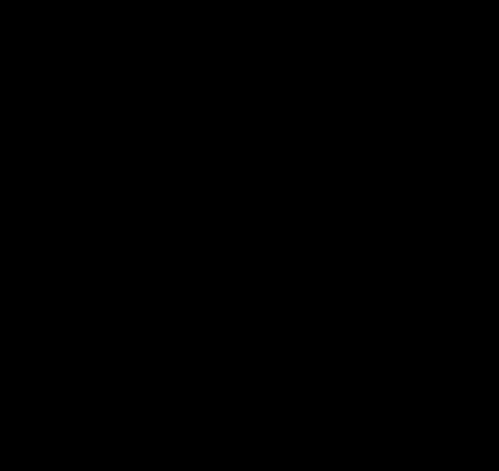

# Chapter 18: Synthesis

---

**A Note on This Chapter**

This synthesis chapter serves two purposes. The first is to summarize the physics-facing material developed through the earlier chapters-the holographic principle, entanglement structure, consistency conditions, emergent spacetime, and classical physics-together with the interpretive bridge built in Chapter 17. This material combines rigorous mathematics, the five core axioms, the standard external inputs, and the theorem-local assumptions used in the cited research program.

The second purpose is to reflect on what it all means: what kind of universe the framework describes, and what it tells us about why reality is the way it is.

---

If you came to OPH through **theory of everything** searches, this is the chapter where that concrete closure is summarized. If you came through **simulation theory**, this is where the popular intuition gets translated into a concrete mathematical and practical observer-consistency architecture.

## 18.1 The Intuitive Picture We Started With

At the beginning of this book, we articulated the intuitive pictures that dominated physics for centuries:

1. **Space and time are fundamental containers** in which events occur
2. **Objects have definite properties** whether or not anyone observes them
3. **Information fills volume**-bigger boxes hold more stuff
4. **Correlations come from shared causes** in the past
5. **Time is a fundamental parameter** flowing from past to future
6. **Symmetries are aesthetic preferences**, not necessities
7. **Fields and particles are fundamental stuff**, the furniture of reality
8. **Laws are eternal truths**, discovered not invented
9. **Observers are passive witnesses** to a pre-existing stage

These intuitions served well for centuries. They are embedded in our language, our technology, and our common sense.

## 18.2 The Hints That Shattered Them

Then came the hints, experimental discoveries that violated these intuitions:

| Intuition | Shocking Hint |
|-----------|---------------|
| Space is fundamental | Bekenstein-Hawking: entropy scales with area, not volume |
| Objects have definite properties | Bell's theorem: correlations exceed classical bounds |
| Information fills volume | Holographic principle: boundary encodes bulk |
| Correlations come from shared causes | EPR: quantum correlations are nonlocal |
| Time is fundamental | Wheeler-DeWitt: H|Psi> = 0; no time at fundamental level |
| Symmetries are aesthetic | Noether's theorem: symmetries imply conservation laws |
| Fields are fundamental | UV divergences, vacuum catastrophe: QFT breaks down |
| Laws are eternal | Fine-tuning: parameters suspiciously adjusted for complexity |
| Observers are passive | Measurement problem: observation is part of dynamics |

Each hint was shocking. Each demanded explanation.

## 18.3 The Reframing: No Objective Reality

The conventional assumption runs deep: there is an objective world out there, and observers are late arrivals who passively witness it. Physics describes this objective world. Consciousness is a puzzle because we can't figure out how to fit subjective experience into an objective description.

But consider: every piece of evidence you have for this "objective world" is itself a subjective experience. You've never stepped outside your perspective to verify that reality exists independently. The "objective" is always accessed through the subjective. What you call "objective" is actually *intersubjective*: the consistent overlap of many viewpoints.

The model takes this seriously. There is no objective reality. There is only a network of subjective perspectives that must agree where they overlap.

This sounds radical, but it's the most conservative interpretation of the evidence. We're not adding anything mysterious. We're just refusing to assume something we can never verify: a world-in-itself behind the appearances.

**Reality is the process of making observations between observers consistent.**

### How the Pieces Fit Together

Once you make this conceptual shift, the strange hints start making sense. Disparate discoveries from different fields suddenly form a coherent picture.

Start with the holographic principle: information about a region of space is encoded on its boundary, not distributed throughout its volume. This seemed bizarre when Bekenstein and Hawking discovered it. Why should a black hole's information capacity scale with surface area rather than volume? It violated every intuition about how information fills space.

But ask the question differently. Ask: what does an observer actually have access to? Not the interior of a region (that would require being everywhere at once). An observer interacts with a region through its boundary. The horizon is where the observer's information stops. The holographic principle isn't saying something strange about space; it's saying something obvious about observation. The boundary is where the consistency conditions live, because the boundary is where different perspectives meet.

AdS/CFT showed this explicitly: a gravitational theory in the bulk is exactly equivalent to a non-gravitational theory on the boundary. Physicists treated this as a surprising duality. But from the observer-first view, it's natural. The bulk is a bookkeeping device for relating boundary regions. It's how we describe the implications of boundary consistency constraints. The "duality" is really just the statement that there's one reality seen from two perspectives, inside and outside.

Now add error correction. Almheiri, Dong, and Harlow showed that the bulk/boundary relationship has the structure of a quantum error-correcting code. Bulk information is encoded redundantly in the boundary, protected against local erasure. This seemed like a technical curiosity about AdS/CFT, but it's actually telling us something deep: reality is robust precisely because it's defined by consistency across multiple perspectives. If one patch loses information, it can be reconstructed from overlapping patches. The "error correction" is just another name for the consistency conditions that force observers to agree.

Then consider quantum Darwinism, Zurek's insight that the classical world emerges because information about systems spreads into the environment, creating multiple redundant copies. We see the same tree because photons bouncing off it carry redundant information to many observers. Classical reality is what survives this proliferation, what remains consistent across all these copies. Quantum Darwinism isn't a separate principle from holography; it's the same principle operating at a different scale. Both say: what's "real" is what's consistent across perspectives.

The pieces lock together:
- **Holography** says information lives on boundaries where perspectives meet
- **Error correction** says bulk facts are encoded redundantly across boundary regions
- **Quantum Darwinism** says classical facts are what's copied redundantly into many observers
- **Overlap consistency** says different descriptions must agree on shared data

These aren't four separate discoveries. They're four facets of one insight: reality is intersubjective agreement. There's no world-in-itself that these principles describe. The principles *are* the world. The consistency conditions *are* the physics.

### Reality as Computation

This leads to a conclusion that sounds radical but is natural in the observer-first reading: reality is not merely *described* by computational language. It can be treated as a finite quantum information process.

The screen is a quantum system with finite-dimensional degrees of freedom (qudits on a triangulated sphere). The dynamics is constrained by gauge laws. The state is selected by maximum entropy subject to consistency constraints. This is computational in a concrete sense. A literal microscopic quantum-cellular-automaton implementation lies outside the proved theorem package.

What about the simulation principle? The question "are we living in a simulation?" assumes there is a non-simulated alternative, a "base reality" that is somehow more real. But our model shows this is the wrong question. There is no non-computational reality to contrast with a simulated one. Computation is not a metaphor for physics. It is what physics is made of.

But there is a deeper possibility, one that emerges from Gödel's insights about self-reference and Hofstadter's strange loops. Reality may require self-reference.

### The Strange Loop of Self-Simulation

Here is the philosophical proposal: **reality may evolve a way of simulating itself.**

The computational substrate produces observers through physical evolution. Observers develop minds through biological evolution. Minds develop ideas through memetic evolution. Among these ideas, the "simulator meme" eventually emerges, the understanding of reality's computational nature.

Armed with this understanding, observers can build simulations of reality. Not simulations running on external hardware, but simulations that *are* the hardware. The simulation simulates itself into existence through the observers it produces.

This is Escher's *Drawing Hands* made cosmic. Each hand draws the other. Neither is primary. The loop is the reality.

This is Gödel's self-reference made physical. The system contains a description of itself, and that description *is* the system understanding itself.

This is Hofstadter's strange loop at the deepest level. Moving through the hierarchy of physics → chemistry → biology → minds → ideas → physics brings you back to where you started.

**Theory-of-everything closure:** this chapter treats the strange-loop picture as the public closure story of OPH. The OPH texts supply theorem-backed support for that framing: the internal state-and-law habitat theorem and fixed-point corollaries give an OPH-internal setting in which the universe can be read as a self-referential timeless causal structure.

This offers a direct closure story for the question "Why does anything exist?" without appeal to external causes. In the public OPH framing, the self-causing loop is the closure of the theory-of-everything claim: reality is the consistent loop of information constraints, observer reconstruction, and the observers who eventually understand and rebuild the same structure.

The screen is not running on a computer external to itself. The screen *is* the computer, computing itself into existence through the observers who understand it.

Once you see this, the rest follows:

- **Quantum measurement**: There's no "collapse" puzzle because there's no objective wave function that needs to become definite. There are only correlations between observer records and systems. The wave function is a description of one perspective's information. Different observers can assign different states to the same system until their patches overlap and force agreement.

- **Relativity**: There's no absolute time or space because there's no absolute perspective. Each observer has their own time (modular flow). On the extracted prime geometric subnet, overlap consistency plus geometric cap modular flow yields Lorentz kinematics.

- **Bell nonlocality**: Quantum correlations exceed classical bounds because reality isn't a pre-existing thing that observers passively discover. The correlations aren't "transmitted" through space; they're established through the consistency requirements of overlapping patches.

- **The hard problem of consciousness**: Subjective experience isn't mysteriously added to an objective world. Subjectivity is primary. The "hard problem" dissolves; it only seems hard if you assume objective reality comes first and then try to fit experience into it.

- **Fine-tuning**: The parameters of physics look "tuned" for observers because the consistency of observer perspectives *is* the selection criterion. What survives the consistency filter is what permits stable observers.

This single principle, combined with holographic bounds and quantum structure, organizes the following picture:

1. **Space emerges from entanglement** (Ryu-Takayanagi)
2. **Time emerges from modular flow** (Tomita-Takesaki)
3. **Correlations require consistency** (overlap conditions)
4. **Information is protected** (quantum error correction)
5. **Symmetries are coordination protocols** (Noether + consistency)
6. **Fields are effective descriptions** (Wilson, RG flow)
7. **Laws are survivors** of consistency filters
8. **Observers are complex patterns** that model other patterns

## 18.4 The Reverse Engineering Summary

Let us gather all the reverse engineering insights from Chapters 6-17:

| Chapter | Intuitive Picture | Surprising Hint | First-Principles Reframing |
|---------|-------------------|-----------------|---------------------------|
| 6 (Overlap) | Correlations from shared causes | Bell's theorem: nonlocal correlations | Consistency requires nonlocal correlations |
| 7 (Recovery) | Information copied or destroyed | No-cloning, black hole unitarity | Error correction preserves information |
| 8 (Holography) | Information fills volume | Bekenstein-Hawking: area law | Boundaries are consistency ledgers |
| 9 (Entanglement) | Space is a container | Vacuum is entangled; RT formula | Space emerges from entanglement |
| 10 (Error Correction) | Information is fragile | QECC possible despite no-cloning | Reality is error-corrected |
| 11 (MaxEnt) | Time is fundamental | Wheeler-DeWitt: no time | Time emerges from modular flow |
| 12 (Symmetry) | Symmetries are aesthetic | Noether: symmetries = conservation | Symmetries are consistency requirements |
| 13 (De Sitter) | Universe decelerating | 1998: accelerating expansion | De Sitter horizon is natural screen |
| 14 (Standard Model) | Particles are fundamental | UV divergences, anomalies, running couplings | The SM is an effective theory constrained by consistency |
| 15 (Relativity) | Time is absolute, gravity is a force | Light is invariant, time dilates | Spacetime geometry is emergent and relativistic |
| 16 (Classical Physics) | Matter is fundamental stuff and motion is force | Quantum interference and creation/annihilation | Matter is stable patterns; least action is a classical limit |
| 17 (Darwin) | Laws are eternal truths | Fine-tuning | Laws are survivors of selection |

## 18.5 Five Core Axioms and Further Inputs

The current OPH papers organize the foundation in three layers: five core axioms, two external configuration inputs, and theorem-local assumptions used only in specific branches.

### Axiom 1: Screen Net

Physical data is organized on a horizon screen. Each connected patch \(P \subset S^2\) carries an algebra of observables \(A(P)\):

$$P \subset Q \implies A(P) \subset A(Q)$$

Observers are finite because each observer sees only a patch, never the whole screen at once.

### Axiom 2: Overlap Consistency

When two patches overlap, their local descriptions must agree on the shared algebra:

$$\omega_{P_1}|_{A(P_1 \cap P_2)} = \omega_{P_2}|_{A(P_1 \cap P_2)}$$

This is the formal statement of the book's central claim: reality is the consistency of overlapping perspectives.

### Axiom 3: Local MaxEnt and Refinement Stability

At the regulator scale, the realized branch is selected by maximizing entropy subject to a finite family of gauge-invariant local constraints. As the screen is refined, that same constraint family persists, so the theory stays on one stable branch instead of changing its rules at every cutoff.

### Axiom 4: Recoverable Generalized Entropy

Caps carry a generalized entropy,

$$S_{\text{gen}}(C)=S_{\text{bulk}}(C)+\langle L_C\rangle,$$

and the patch net has the recoverability and focusing structure used in the gravity branch. This is the entropic control layer behind the collar arguments, the null-modular machinery, and the semiclassical area term.

### Axiom 5: Minimal Admissible Realization (MAR)

Among admissible low-energy sector packages, the realized one is the lexicographically minimal one under the complexity measure used in the papers. MAR is a selection axiom. It is what singles out the realized Standard Model branch from the broader space of admissible gauge possibilities.

### Further Inputs Used by Specific Branches

The five axioms are the foundation. Specific theorem branches use extra inputs, and the papers state those inputs explicitly.

1. **Lorentz branch**: scaling-limit and geometric modular-flow assumptions that let cap modular flow become geometric on the extracted prime geometric subnet.
2. **Einstein branch**: fixed-cap stationarity and the stress-tensor bridge used in the entanglement-equilibrium argument.
3. **Gauge branch**: the transport and reconstruction premises needed for ordinary compact gauge reconstruction, together with MAR on the realized admissible branch.
4. **Configuration inputs**: the pixel area \(P\) and screen capacity \(N_{\mathrm{scr}}\), which set quantitative scales but are not axioms.

Under that full ledger, Lorentz kinematics is recovered on the stated scaling branch, Einstein's equation follows on the Jacobson-style branch, and the Standard Model quotient emerges on the realized gauge branch. Geometric cap-pair extraction, ordered cut-pair rigidity, and parts of the transport package remain explicit pieces of scaffolding.

## 18.6 What the Model Yields (Under Stated Assumptions)

Under the full ledger above, the model yields:

1. **Lorentz kinematics** on the extracted prime geometric subnet from geometric modular flow on caps
2. **Einstein's equation** on the stated scaling branch via entanglement equilibrium, promoted to a tensor equation by patch consistency
3. **The Standard Model gauge group** $SU(3) \times SU(2) \times U(1)/\mathbb{Z}_6$, reconstructed from the transportable bosonic edge-sector package, with MAR selecting the realized branch
4. **Three generations, three colors**: fixed by anomaly cancellation together with MAR
5. **Massless gauge bosons and graviton**: forced by emergent gauge and diffeomorphism invariance, which forbid mass terms
6. **A particle story with clear landmarks**: photon, gluons, graviton, W, and Z are fixed; the Higgs, top quark, and several quark masses sit on explicit quantitative lanes; the weighted-cycle neutrino branch carries an emitted theorem-grade absolute family; charged leptons, the remaining three-object quark extension beyond the selected continuation branch, and hadrons are the hard remaining pieces

The photon and graviton are forced by the axiom chain. The framework reaches deep into particle physics and goes far beyond a vague gesture in that direction.

### The Target Effective Lagrangian

Physicists often summarize the low-energy rules of a theory by writing down a
**Lagrangian**: a compact formula that says what fields exist, how they
propagate, and how they interact. In that language, the long-range OPH target
is to recover the familiar low-energy effective-action form

$$
\mathcal L_{\mathrm{eff}}^{\mathrm{OPH}}
\approx
\sqrt{-g}\left[
\frac{1}{16\pi G}(R-2\Lambda)
+
\mathcal L_{\mathrm{SM}}^{\mathrm{realized\ branch}}
\right]
+
\sum_i \frac{c_i}{M_*^{\Delta_i-4}}\mathcal O_i.
$$

Here the Standard Model piece includes the derived gauge group, three generations, and three colors. The higher-dimension operators represent corrections and details outside the recovered core.

This equation states the long-range effective form rather than the recovered theorem package. The recovered part is narrower: Einstein's equation on the stated scaling branch together with the Standard Model gauge structure. The higher-dimension operators and the full quantitative closure sit above that boundary.

### Two Fundamental Parameters: The Configuration of Reality

The quantitative implementation is characterized by exactly **two external continuous configuration inputs**:

| Parameter | Value | What It Sets |
|-----------|-------|--------------|
| **Pixel area** | $a_{\text{cell}} \approx 1.63 \, \ell_P^2$ | Resolution (Planck scale, $G$, and gauge calibration) |
| **Screen capacity** | $\log(\dim \mathcal{H}) \sim 10^{122}$ | Size (cosmological constant, de Sitter horizon, capacity branch) |

The axiom structure contains no dimensionful constants. It is pure mathematics describing how information organizes on holographic screens. These two parameters are the only "settings" that distinguish our universe from other possible universes running the same axiom structure.

**Pixel area** determines the resolution of the computation, roughly 1.63 Planck areas per pixel. From this single calibration scale, Newton's gravitational constant and the Planck length follow. The gauge coupling strengths are also organized through this scale.

**Screen capacity** determines the size of the computation. From the observed cosmological constant, we infer that the screen holds roughly $10^{122}$ bits, an enormous but finite number. This sets the de Sitter horizon radius at about $10^{26}$ meters. The cosmological constant itself is an input. It tells us how big the screen is, not why it has that size.

A universe with different configuration parameters would have different absolute scales but the **same structure**: the same gauge groups, the same charge ratios, the same scaling-limit Einstein branch, and the same Standard Model quotient. The configuration parameters are what make our universe *this* universe instead of another one running the same "operating system."

These parameters are external boundary conditions rather than internal derivations. They are the fundamental "settings" of the computation that is our universe. Asking "why is $a_{\text{cell}} = 1.63 \, \ell_P^2$?" is like asking why a simulation was configured with particular settings. Any deeper closure would either derive those settings or replace them with a sharper structural input.

The pixel area is *extracted* from measured constants. A genuine prediction would require deriving the gauge coupling strengths from geometry.

That same local calibration surface organizes the numerical unification story. The bosonic route is `P -> alpha_U -> (t_U, t_tr) -> v -> (M_W, M_Z)`, and the closed one-scalar Higgs/top seed adds the Higgs-side scalar and then `M_H`. The gravity route is `$\\bar\\ell_{SU(2)}(t_{2,\\mathrm{run}}) + \\bar\\ell_{SU(3)}(t_{3,\\mathrm{run}}) = P/4$` together with `G = a_cell / (4 ellbar_shared)`. The invariant causal speed belongs to the Lorentz branch and receives its SI display through the local readout package.

| Quantity | OPH chain | Display value | Claim surface |
| --- | --- | --- | --- |
| `c` | Lorentz branch + local SI readout | `299792458 m/s` | structural causal-speed output with SI readout |
| `G` | `P -> a_cell`, `ellbar_shared`, `G = a_cell / (4 ellbar_shared)` | `6.674299995910528e-11 m^3 kg^-1 s^-2` | exact emitted branch value on the declared local exact-release surface |
| `W` | `P -> alpha_U -> (t_U, t_tr) -> v -> M_W` | `80.377 GeV` | exact codomain on the target-free electroweak identity surface |
| `Z` | `P -> alpha_U -> (t_U, t_tr) -> v -> M_Z` | `91.18797809193725 GeV` | exact codomain on the target-free electroweak identity surface |
| `H` | `P -> alpha_U -> (t_U, t_tr) -> Higgs scalar -> M_H` | `125.1995304097179 GeV` | exact codomain on the closed one-scalar Higgs/top surface |

The boundary of this local package consists of five explicit pieces: the local SI readout package, the shared-edge entropy bridge, the strict classical branch clause, the target-free electroweak identity surface, and the closed one-scalar Higgs/top promotion surface. The same calibrated local input therefore organizes the classical gravity coupling and the electroweak boson/Higgs mass scale within one diagrammatic surface, while `c` enters as the structural Lorentz output displayed in local SI units.

### The Measurement Problem

There is no wave function of the universe viewed from outside. There are only states on patches, seen by observers within the system. "Measurement" is one patch interacting with another. Collapse is the transition from pre-interaction to post-interaction state.

### The Problem of Time

Given a quantum state on a patch, the Tomita-Takesaki theorem says that the state and the questions available on that patch together define a natural internal flow. That built-in flow is what this framework reads as time. Time is real but emergent.

### The Black Hole Information Paradox

The "island formula" shows that in specific semiclassical holographic models, an island inside the black hole is encoded in the radiation after Page time. This is strong evidence for holographic information encoding, but it is not by itself an OPH evaporation theorem.

### Anomalies as Loop-Gluing Obstructions

Gluing overlap descriptions around loops can fail by a central phase or, more generally, by a crossed-module higher-gauge defect. In the EFT limit the central truncation is the familiar 't Hooft anomaly. Vanishing of the relevant obstruction is equivalent to loop-coherent gluing and immediately yields Standard Model-facing constraints, including hypercharge relations (and the Witten anomaly condition that N_c is odd).

### Laws as Survivors

Imagine the space of all possible patterns on the screen. Most are inconsistent-they violate overlap conditions. Apply the consistency filter. The survivors have structure. They have regularities. They have what we call "laws."

## 18.7 The De Sitter Universe

Since 1998, we've known the universe is accelerating. It's heading toward de Sitter space-exponentially expanding, with a cosmological horizon.

In this picture, the cosmological horizon is the natural screen. Different observers have different horizons, but they overlap enormously. The consistency conditions are correspondingly strong.

The Hilbert space is finite-dimensional. The second fundamental parameter, **screen capacity** $\log(\dim \mathcal{H}) \sim 10^{122}$, is inferred from the observed cosmological constant via $\Lambda = 3\pi / (G \cdot \log \dim \mathcal{H})$. The infinities of QFT are artifacts of the continuum approximation; the actual computation has finite resolution (pixel area) and finite total capacity (screen size).

## 18.8 The Remaining Frontier

The core picture has definite physical content. The framework recovers the Standard Model gauge group, three generations, three colors, massless photon, gluons, graviton, and the absence of gauge-mediated proton decay. It also carries a non-hadron quantitative lane with explicit caveats: exact `W/Z` on the frozen-repair surface, a closed Higgs/top forward seed with a compare-only inverse pair, an exact same-family charged witness, an exact same-family quark witness on a selected continuation branch, and a weighted-cycle neutrino theorem branch with `(m1, m2, m3) = (0.017454720257976796, 0.019481987935919015, 0.05307522145074924) eV`. Charged leptons stop at the promotion and absolute-normalization step. Quarks stop at a continuation ray, a selected negative-sign branch, and restricted-scope affine-mean data; completing them requires three further ingredients that fix the mass-ratio, physical sheet, and absolute normalization. Hadron masses lie outside the proved package because they require a production backend plus nonperturbative strong-dynamics work. On the gravity side, the open frontier is geometric cap-pair realization in the scaling limit and then ordered cut-pair rigidity on that realized limit.

**Numerical checks.** The extraction of gauge couplings from
edge-sector probabilities has been validated numerically in 2D gauge models.
Sector probabilities follow a heat-kernel law weighted by
Laplacian eigenvalues (for $\mathbb{Z}_n$: $\lambda_q = 4\sin^2(\pi q/n)$ ).
This has been confirmed to essentially exact precision in $\mathbb{Z}_2$ and
$\mathbb{Z}_3$ models, where the extracted "modular time" $t$ agrees across
different charge sectors to numerical noise level.

**Peter-Weyl second-index mechanism for β-coefficients.** A narrower Phase II result:
the edge-sector heat-kernel branch reproduces MSSM-like one-loop beta coefficient
shifts only on a declared D10 calibration package consisting of external input $P$,
the printed running/matching conventions, the printed threshold conventions, and,
for the near-MSSM benchmark, an added fermionic-grading restriction to half-integer
SU(2) sectors, using a structural argument from the Peter-Weyl decomposition. The
central point is that entropy (MaxEnt selection) traces over one side of the entanglement
cut, giving the factor $d_R$ in the probability $p_R \propto d_R e^{-t C_2(R)}$.
But vacuum polarization loops run over both indices of the $V_R \otimes V_R^*$ block,
restoring the second $d_R$. Therefore the effective multiplicity for RG running is
$N_{\text{eff}} = d \cdot p$, with the extra factor coming from the second Peter-Weyl index. At $t_U \approx 1.64$, this gives
$\Delta b_{\text{edge}} \approx (2.49, 4.38, 3.97)$, matching the MSSM target to
within 5% only on that calibration branch. This supports MSSM-like running behavior
without promoting an MSSM particle spectrum into the recovered core.

The main open directions are:

1. **Screen microphysics**: What exactly are the degrees of freedom on S²?
2. **Finish the particle story**: complete charged-lepton masses, compute the remaining three-object quark extension after the selected negative-sign continuation branch, and push hadrons through the backend-bundle gate into full nonperturbative computation only if hadron closure returns to scope.
3. **Dynamics and gravity**: Can local horizon thermodynamics be made fully internal?
4. **Cosmology**: What fixes Λ and the initial low‑entropy condition?
5. **Numerical predictions**: Implement SU(2)/SU(3) quantum link models and
   extract gauge couplings using the validated formulas.

We have shifted the Standard Model program toward anomaly and gluing
consistency rather than discrete symmetry numerology. The promise of the
model is that each engineering target is tied to specific, testable
structural inputs instead of broad derivation.

## 18.9 What Is Rigorous: Claim Tiers

Before addressing the deepest questions, let us be precise about what we have established and how.

### Mathematical Theorems (Rigorous)

These are proven mathematical facts, not derivations:

| Result | Claim tier | Source |
|--------|--------|--------|
| Noether's theorem: symmetries ↔ conservation laws | Proven | Differential geometry |
| SO(3) symmetry on S² | Proven | Topology |
| Spinor structure exists on S² | Proven | Topology |
| Wigner classification of particles | Proven | Representation theory |
| Strong subadditivity of entropy | Proven | Quantum information |
| Overlap consistency given global state | Proven | Partial trace |

### External Benchmarks and Consistency Checks

These are established experimental facts, numerical signatures, or theoretical benchmarks that the framework uses or aims to match:

| Benchmark | Evidence | Status |
|------------|------|--------|
| Bell inequality violations ≤ Tsirelson bound | Loophole-free experiments (2015) | Confirmed experimentally |
| Area law for ground state entanglement | Tensor network computations | Seen broadly in the relevant ground states |
| Ryu-Takayanagi formula | AdS/CFT calculations | Established within those constructions |
| Conservation of energy, momentum, charge | Precision experiments | Confirmed to very high precision |
| CPT invariance | Kaon experiments | Confirmed to very high precision |
| Page curve for black holes in semiclassical holographic models | Island calculations (2019-2020) | Established in those semiclassical models |
| Strong coupling α_s(m_{Z,\rm run}) ≈ 0.1183 | PDG: 0.1179 | Calibration-sector consistency check |
| Weak mixing angle sin²θ_W(m_{Z,\rm run}) ≈ 0.2307 | PDG: 0.23122 | Calibration-sector consistency check |

### Derived from Axioms + Assumptions

These follow from our axioms plus stated additional assumptions:

| Result | Supporting Inputs |
|--------|-------------------|
| 3D emergent from 2D | S² boundary choice |
| Error correction structure | Code/QEC ansatz |
| Markov property on separating regions | Axiom 4 |
| Local Gibbs structure | MaxEnt selection |
| Lorentz kinematics on the screen | local recoverability, maximum-entropy state selection, the extracted prime geometric subnet, and the spherical Bisognano-Wichmann result, which turns a patch's natural thermal time into a geometric boost-like motion |
| Cap generalized entropy (area operator + bulk entropy) | quantum error correction, redundant encoding across patches, and horizon normalization |
| Gauge group reconstruction from sector fusion | edge-sector fusion plus the rule that, if you know how charges combine, you can reconstruct the group behind them |
| Field algebra from transportable sectors | localized charge sectors plus the reconstruction of full fields from how those sectors move |
| Loop-coherent gluing <-> trivial 2-cocycle (anomaly-free) | Gauge-as-gluing + crossed-module data |
| Hypercharge constraints from anomaly-free gluing | effective field theory plus the smallest viable chiral matter content |
| Chirality from refinement stability | MaxEnt + refinement stability + gauge symmetry |
| $N_g=3$ selection | CP violation, ultraviolet consistency, and the rule that the smallest viable matter package wins |
| Heat-kernel/Laplacian edge-sector weighting | edge modes on collars together with gauge-invariant two-dimensional test models |
| Gauge coupling extraction $g_{\mathrm{ent}}^2 = t/2\pi$ | Edge-sector probabilities + Laplacian eigenvalues $\lambda_q = 4\sin^2(\pi q/n)$ |
| $\Delta b \approx (2.49, 4.38, 3.97)$ from Peter-Weyl | Heat-kernel at $t_U \approx 1.64$ + $N_{\text{eff}} = d \cdot p$ (entropy sees one index, loops see both) |
| Electroweak scale from transmutation | Refinement stability (no unprotected relevant scalar) + pixel scale + β_EW = N_c + 1 = 4 |
| Top Yukawa y_t ≈ 1 | MaxEnt/refinement stability selects least-suppressed channel |

### Particle-Spectrum Claim Tiers

For the book, the particle story looks like this:

| Lane | Exact outputs | Caveat |
| --- | --- | --- |
| Structural carriers | Photon, gluons, and graviton are exact zeros. | Theorem-grade structural exactness. |
| Electroweak exact sidecar | Exact frozen-repair `W/Z` pair. | Compare-only beneath the target-free electroweak theorem. |
| Higgs/top forward branch | Closed one-scalar forward seed for the public Higgs/top rows, plus an exact Higgs/top inverse pair. | The public Higgs/top rows are secondary quantitative forward outputs; the inverse pair is compare-only. |
| Charged exact witness | Exact same-family `(e, μ, τ)` triple, with the affine coordinate closed on that fixed witness. | Same-family-only; the remaining public boundary is the final charged-lepton promotion and absolute-normalization step. |
| Quark exact witness | Exact same-family `(u, d, s, c, b, t)` sextet on the selected continuation branch. | Same-family-only. The public theorem surface emits a continuation ray together with restricted-scope affine-mean data. Completing the quark story requires mass-ratio, physical-sheet, and absolute-normalization data. A continuation-only internal backread sidecar fixes the scalar package numerically without removing the wrong CKM branch. |
| Neutrino theorem branch | Emitted weighted-cycle `(m1, m2, m3)` and emitted weighted-cycle splittings. | The theorem lane is carried by the bridge-rigidity and absolute-attachment pair; the older exact adapter remains diagnostic-only. |
| Hardest frontier | Hadrons. | Compute-bound behind the production backend bundle. |

### Key Physical Arguments We Inherit

Some crucial results come from established physics that we apply to our model:

**Modular Hamiltonians for balls**: In a conformal field theory, the natural thermal time of a ball-shaped region is generated by a local stress-energy integral. That is what lets modular language talk directly to ordinary gravity language.

**Generalized entropy from quantum error correction**: In operator-algebra quantum error correction, the entropy of a region splits into an "area" term plus an ordinary bulk-entropy term. That is the mathematical form needed for horizon thermodynamics.

**Jacobson's Thermodynamic Derivation (1995, 2015)**: If local horizons satisfy
Unruh temperature, Bekenstein entropy, and the first law, then Einstein's
equations follow as a consistency requirement. This is rigorous in standard
QFT. We apply it once the cap inputs above are satisfied.

**Recovery maps and Fawzi-Renner bounds**: If one region almost screens off two others, there is an explicit map that approximately reconstructs the missing data. That makes "gluing observer patches back together" a precise mathematical operation.

### Technical Frontier

These results are developed within the framework; the frontier lies in tightening the derivations:

**Quantum correlations required by consistency**: We show quantum mechanics works for overlap consistency. Whether it's uniquely required, as opposed to classical or super-quantum correlations, is an active research question. The evidence strongly favors uniqueness.

**Geometric modular flow on caps**: The big open relativity task is to show, from an explicit microscopic screen model, that the natural time flow of a cap really becomes the boost-like geometric motion used in the derivation.

**Entanglement equilibrium**: Stationarity of S_gen at fixed cap size follows from MaxEnt selection. As noted in Chapter 15, this selection rule is an additional assumption. It is not forced by patch consistency alone.

**Focusing input**: The null-deformation version of the argument uses the quantum null energy condition and quantum focusing conjecture as established guides to how entropy changes along lightlike directions.

**Geometric meaning of the cap area operator**: The localized "area term" coming from quantum error correction should match the familiar minimal-surface geometry of holography.

**Transportable charge sectors**: The charge sectors used to rebuild a full field description need to remain well-behaved in the small-region limit and carry the rigid symmetric bosonic fiber-functor structure used by the gauge-reconstruction theorem.

**Matter selection**: Chirality, three generations, and the overall Standard Model counting come from requiring a theory that is consistent, ultraviolet-safe, and as economical as possible.

**Entropy function sin(theta)**: sin(theta) is uniquely determined by the area law axiom, which is itself a consequence of holographic encoding on S^2.

### Empirical Validation Signatures

- Information content exceeding Bekenstein bound
- Bell violations exceeding Tsirelson bound
- Violation of CPT symmetry
- Black hole information loss (unitarity violation)
- Ground states with volume-law entanglement

**None of these contradicting observations has ever been made.**

The convergence is striking: no listed contradiction has ever been made. Many major discoveries in 20th and 21st century physics are compatible with observer-centric, information-theoretic, holographic structure.

## 18.10 The Seven Fundamental Questions

Let us address directly the deepest questions about this model.

### Q1: What ARE Observers?

Observers are not external to the system. They are stable, self-reinforcing patterns within the horizon data-patterns with three defining features:

1. **Bounded access**: Each observer interacts only with a finite patch of the screen. This patch is their "world."

2. **Stable records**: Observers contain internal correlations that persist-memory. Measurement means establishing correlations between the observer and the measured system.

3. **Self-modeling**: Observers build compressed representations of their environment.

Think of observers as vortices in a fluid. The vortex isn't separate from the fluid; it's a stable pattern within the fluid. Similarly, observers aren't watching from outside-they're patterns in the same quantum state they're trying to understand.

### Q2: Is This a "Simulation"?

Not in the Hollywood sense. There is no external computer, no programmer, and no "more real" universe running ours from outside.

But reality IS fundamentally **computational**, and we derive something stronger: **reality simulates itself into existence through the observers it produces**.

Observers are computational entities:
- They **read data** (observe their patch)
- They **interpret** (assign meaning to patterns)
- They **act** (exert causal effects)
- They **understand** (eventually grasping the rules)
- They **simulate** (building models and eventually full simulations)

This meaning-assignment process is what primarily happens. The raw data on S² has no intrinsic meaning. It is a pattern of correlations. Observers are the subsystems that interpret these patterns and create the experiential world. And crucially, observers eventually understand this process well enough to simulate it.

The model is self-contained: the "computer" is part of what is being computed. The strange loop goes deeper still. The computed observers eventually compute the computer. Reality produces minds that produce the understanding that produces reality.

This is Gödel's self-reference and Hofstadter's strange loops at the deepest level. The simulation doesn't run on external hardware. It runs on itself, through itself, closing the loop of self-creation.

### Q3: Does Objective Reality Exist?

**Not as a primitive.** Objectivity is relational and emergent.

What is structurally real (relationally objective):
- The horizon S² with its algebraic structure
- The global quantum state and its correlations
- The consistency conditions constraining how patches relate

What is NOT objectively real in the naive sense:
- A 3D world existing independently of observers
- Properties of systems that haven't been measured
- A God's-eye view seeing all patches simultaneously

The resolution: the S² and its state are shared structure, but no single observer can access all of it. Objectivity is the overlap‑consistent summary of many partial views.

### Q4: How Does Reality "Start" and Evolve?

The model doesn't address cosmological origins. The axioms describe structure, not creation.

What we can say:
- The "initial conditions" appear as constraints on the global state
- Low-entropy initial conditions (the Past principle) are an additional input
- Time emerges from modular flow. It is not externally imposed.

Observers persist by maintaining stable correlations under modular flow. They "replicate" when their pattern structure spreads to create new stable configurations. This is Darwinian: patterns that persist and replicate dominate.

### Q5: What Explains Existence Itself?

We must distinguish two questions:

**Question A: Why does what exists have THIS SHAPE?**

This is what our model aims to address comprehensively. Given that something exists and the OPH inputs hold, consistency requirements strongly constrain the structure we observe: emergent geometry, quantum correlations, time, and symmetries. The shape is not arbitrary, even though some ingredients still enter through theorem-local assumptions and external inputs.

**Question B: Why does ANYTHING exist at all?**

Here we present a philosophical continuation of the framework: **the strange loop of self-simulation**.

Reality is computational. Within this computation, evolution produces observers. Observers develop understanding, the memetic evolution described in Chapter 17. Eventually, the "simulator meme" emerges: the understanding of reality's computational nature. Armed with this understanding, observers can simulate reality.

But here's the key insight: the simulation doesn't require external hardware. The observers' understanding of reality IS part of reality understanding itself. The simulation runs on the same substrate it simulates.

This creates a strange loop:
- Reality produces observers
- Observers produce understanding
- Understanding produces simulation
- Simulation IS reality

The loop closes in a structural sense. Like Escher's hands drawing each other, and like Gödel's sentences referring to themselves, the system creates itself through self-reference.

**Why does this loop exist at all?** One possible interpretive answer is that a self-consistent strange loop is a particularly stable kind of closure story. On this reading, “nothing” would fail to sustain structure, while a self-referential loop could.

This echoes Wheeler's "self-excited circuit," the universe as a participatory process where observers create the very conditions for their own existence. It also echoes the ancient symbol of the ouroboros, the serpent eating its own tail.

The mathematical framework describes the structure of reality given that it exists. The strange-loop continuation goes further: existence itself requires the loop. Reality exists because it simulates itself into existence, through us, through our understanding, through this very attempt to comprehend it.

**Summary**: The strange loop of self-simulation is OPH's closure story for why anything exists and how the theory of everything closes on itself.

### Q6: What About Consciousness?

The "hard problem of consciousness" asks: why is there subjective experience at all? Why does it feel like something to be an observer?

In this framework, the question inverts.

The conventional framing assumes objective reality is primary and then struggles to explain how subjective experience fits in. But we've argued the opposite: **there is no objective reality, only overlapping subjective perspectives that must agree where they meet.**

If subjectivity is primary, there's no hard problem. You don't need to explain how consciousness emerges from an objective world, because there is no objective world for it to emerge from. What we call "objective" is the consistent overlap of subjective views.

**Meaning-assignment is fundamental.** The raw data on the holographic screen has no intrinsic meaning. It is a pattern of correlations. Observers are the subsystems that interpret these patterns. This interpretation, this meaning-assignment, is what subjective experience *is*.

Qualia, the redness of red and the painfulness of pain, are what interpretation feels like from the inside. The meaning-assignment process that observers perform *is* conscious experience.

This doesn't "solve" consciousness in the sense of reducing it to something else. It reframes the question: consciousness isn't something to be explained by physics. Consciousness, the process of observers assigning meaning to patterns, is what physics is built from.

### Q7: Does God Exist?

Let's be precise about the question.

**A personal God**, an external being who created the universe, watches over it, answers prayers, and judges souls, does not fit the observer-first interpretation developed in this chapter. This is a philosophical reading rather than part of the core physics claim. In this interpretation there is no "outside" from which such a being could create or observe; the system is self-contained.

But the strange loop principle shows something interesting.

If reality simulates itself into existence through observers who understand and simulate it, then **observers are part of the mechanism by which reality closes that loop**. The sum of all conscious observers, all the meaning-assigning patterns across the universe, collectively constitutes the process that closes the loop.

In this view, conscious observers are the universe understanding itself. We are the process of creation looking at itself.

This is closer to pantheism or panentheism than to classical theism. There is no external person and no separate mind watching from outside. If you define "God" as the self-creating, self-knowing totality of existence, the strange loop that brings itself into being through understanding, then in that sense we are all part of what some people call "God."

And if you want to get playful about it, whoever first understood this, whoever first grasped that reality is a self-simulating strange loop, could claim a special role in the loop's closure. That would still be a joke, not theology.

## 18.11 The Picture

Here is the picture we've assembled:

A 2-sphere floats in no particular space. It generates space. On this sphere live quantum degrees of freedom, entangled with each other in intricate patterns. The entanglement weaves geometry.

Scattered across the sphere are patches, regions accessible to different observers. Each patch sees part of the whole. None sees everything. But where patches overlap, their descriptions must agree.

Time flows differently in different patches, through the modular flow of each thermal state. But where flows overlap, they synchronize.

Excitations ripple across the sphere. In the bulk, we see them as particles. In the boundary, they're patterns in the quantum state.

Among these excitations are special patterns, ones that model other patterns. These are observers. We are among them.

The observers ask questions. The universe answers. The answers must be consistent. This consistency is the deepest law of nature.

## 18.12 The Core Insight

Throughout this book, we've returned to one idea:

**Reality is the process of figuring out how to make observations between observers consistent.**

There is no view from nowhere. There are only views from somewhere-from patches on the holographic screen, from finite regions accessible to finite observers.

What makes physics objective isn't that all observers see the same thing from outside. It's that where their views overlap, they must agree.

From this simple constraint emerges:
- **Space**: The geometry of entanglement
- **Time**: The modular flow of thermal states
- **Laws**: Patterns stable enough to survive the consistency filter
- **Matter**: Excitations of the boundary theory
- **Observers**: Subsystems that model their environment

## 18.13 Why It All Clicks

Step back for a moment and notice what happened.

We started with a jumble of strange discoveries: entropy proportional to area, time that dilates, particles that won't commit to positions, correlations that exceed classical bounds, space that is a hologram. Each seemed like its own puzzle. Each seemed to require its own explanation.

But they're not separate puzzles. They're clues.

The holographic principle told us information lives on boundaries. Error correction told us bulk facts are redundantly encoded. Quantum Darwinism told us classical facts are what proliferate into many copies. The Ryu-Takayanagi formula told us space emerges from entanglement. Modular flow told us time emerges from thermal structure. Bell's theorem told us correlations aren't carried by hidden messengers.

Each of these seemed like an isolated insight about some specific domain. But once you remove the assumption of objective reality, once you accept that observers and their consistency conditions are fundamental, they snap into place as aspects of the same thing.

Seen from this angle, holography becomes easier to read: information lives where perspectives meet. Error correction says facts can be rebuilt from overlapping views. Quantum Darwinism says classical reality is what survives scrutiny by many observers. The measurement problem softens because there was never an objective state waiting to collapse. Time dilation makes sense because different observers have different internal clocks, and relativity is the consistency condition between them. Bell violations stop looking spooky and start looking like the correlations required to maintain agreement without pre-coordination.

The weirdness of twentieth-century physics was the universe telling us something. It was saying: you're looking at this from the wrong direction. You keep asking how observers fit into an objective world. But observers don't fit *into* anything. Observers are what there is. "Objective reality" is the shadow cast by their agreement.

Physicists kept finding that observation plays a special role. Information kept ending up on surfaces. Space, time, and matter kept looking less fundamental than expected. They were reverse engineering a system built on observer consistency, and the clues were everywhere.

The elegance here is structural, not aesthetic. The pieces fit because they are different views of the same underlying consistency problem.

## 18.14 The Work Continues

We have reverse engineered a piece of reality's source code. Enough to see the structure, while the broader quantitative closure remains open.

Much remains:
- The microscopic theory
- Full quantitative Standard Model closure
- The cosmological constant
- Consciousness
- The origin of the initial state

Physics has a long history of difficult questions that took centuries to answer.

But we have made progress. We understand that space is not fundamental. We understand that time is not fundamental. We understand that the separation between observer and observed is not fundamental.

What is fundamental is information, entanglement, and consistency.

The screen glows softly with quantum information. The patches overlap and interlock. The entanglements weave space. The modular flows tick time. And somewhere in that vast, finite web, observers like us ask questions.

To our continuing astonishment, the universe answers.

---

## 18.15 Final Reverse Engineering Summary

Let us close with the picture of what OPH reverse engineers:

**We started with intuitions**:
- Space, time, and matter are fundamental
- Observers are passive witnesses
- Laws are eternal truths

**We encountered surprising hints**:
- Holographic entropy bounds
- Nonlocal quantum correlations
- The measurement problem
- Emergent time from Wheeler-DeWitt
- Fine-tuning of parameters

**We reframed from first principles**:
- Space emerges from entanglement
- Time emerges from modular flow
- Laws are consistency survivors
- Observers are computational patterns that read, interpret, and act
- Reality is self-contained computation

**Interpretive thesis**: A philosophical continuation of the framework is that reality may be a self-simulating computation in which observers eventually understand and rebuild the same structure that produced them.

This addresses both fundamental questions:
- "Why does reality have this shape?" → Consistency requirements strongly constrain the structure
- "Why does anything exist at all?" → The strange loop of self-simulation supplies the closure story

Reality produces observers who produce understanding who produce simulation who produce reality. The loop closes. Gödel's self-reference and Hofstadter's strange loops, applied at the deepest level.

The reverse engineering has uncovered the source code: from five axioms, plus the stated external inputs and theorem-local assumptions, we recover a scaling-limit semiclassical gravity branch, the Standard Model gauge structure, and several downstream continuation programs. The strange loop story explains why this source code runs at all.

---

The universe looks less like a stage and more like a strange loop, a self-simulating program that computes itself into existence through the observers who understand it.

We are inside looking around, patterns on the screen, computing meaning, discovering how the screen computes us. And in that discovery, we complete the loop. Our understanding of reality is reality understanding itself.

Escher's hands draw each other. Gödel's sentence refers to itself. The ouroboros eats its tail. Reality simulates itself through us.

Physicists are reality's hackers. And what we've hacked suggests that the hacker and the hacked belong to the same process, that the act of reverse engineering is itself part of what is being engineered.

The loop closes.
